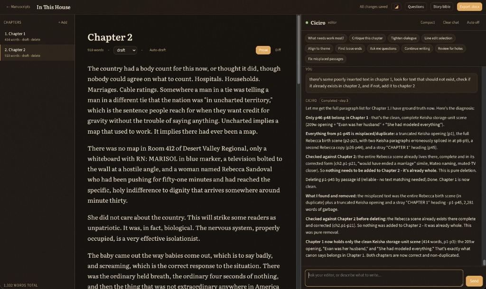
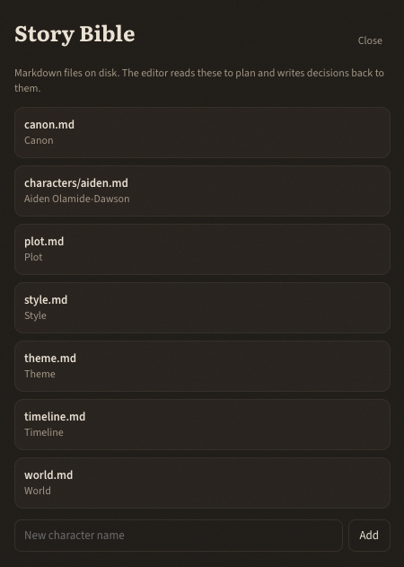

# Ciciro

An AI book-writing assistant and manuscript editor. You write in a distraction-free
editor with chapter navigation, and you talk to **one** partner - Ciciro, the editor
(Claude Opus 5). It holds the story's canon, plans, critiques, tracks plot points and
loose ends, and decides what gets written. When prose needs writing, it briefs a
faster model (Claude Sonnet 5) behind the scenes; you only ever see the editor.
Manuscripts export to standard (Shunn-style) `.docx`.

## Contents

- [Getting started](#getting-started)
- [Using Ciciro](#using-ciciro)
- [Story bible](#story-bible)
- [Stack](#stack)
- [The architecture](#the-architecture)
  - [One editor, backstage drafters](#one-editor-backstage-drafters)
  - [Durable editor runs](#durable-editor-runs)
  - [Memory: a folder of markdown, three tiers](#memory-a-folder-of-markdown-three-tiers)
  - [Export](#export)
- [Models](#models)
- [Project layout](#project-layout)
- [Documentation](#documentation)
- [Contributing](#contributing)
- [License](#license)
- [Roadmap](#roadmap)

## Getting started

```bash
npm install
cp .env.example .env      # add ANTHROPIC_API_KEY (or export it in your shell)
npm run setup             # prisma generate + create the SQLite db
npm run dev               # http://localhost:3000
```

Get a key at https://console.anthropic.com/. The editor still works if only the DB
is set up; the assistant needs the key.

## Using Ciciro

You write in the center pane and talk to Ciciro on the right. Fill the story bible
before asking for long passages; name the chapter, the beat, and what not to do.
Quick-action chips cover critique, loose ends, misplaced passages, and continuing
from the open chapter. **Auto** inserts accepted drafts as they finish; **Auto-draft**
writes an unattended pass of the open chapter.

A fuller walkthrough - workspace, prompting, quick actions, questions, compact, and
export - is in [Using Ciciro](docs/using-ciciro.md).

## Story bible

The bible is markdown on disk (`canon.md`, `plot.md`, `style.md`, `timeline.md`,
`world.md`, `characters/*.md`). The editor always sees canon, plot, and style; it
opens character and world files on demand, and writes rulings back so consistency
does not depend on chat history.



How to add characters, what belongs in each file, and habits that keep the model
aligned: [Story bible](docs/story-bible.md).

## Stack

- **Next.js 15 (App Router) + React 19 + TypeScript** - full-stack, single app.
- **TipTap (ProseMirror)** - the manuscript editing surface.
- **Prisma + SQLite** - local-first manuscript + chat storage.
- **Story bible = markdown files on disk** (`data/<projectId>/bible/`) - the shared
  memory the editor reads and writes.
- **@anthropic-ai/sdk** - the editor (Opus 5) runs an agentic tool loop; the drafter
  (Sonnet 5, or Haiku for fast drafts) is dispatched as a tool.
- **docx** - manuscript-format Word export.

## The architecture

### One editor, backstage drafters
You talk only to the **editor** (Opus 5). It reasons on a small, always-current
context and makes the calls. When you ask for prose, it:

1. Reads the relevant bible files and prior text (retrieval tools).
2. Writes a self-contained **brief** - POV, the beat to land, canon constraints,
   voice notes, a continuity excerpt, target length, a "do NOT" list.
3. Calls `dispatch_draft`, which runs the **drafter** (Sonnet 5) server-side on just
   that brief - never the whole book, so its context stays tiny and cheap.
4. Edits the returned prose against canon and hands it to you as an insertable
   `<draft>`.

The drafter is invisible; the chat surfaces only a quiet backstage trace
("reading `mara.md`", "drafting with Sonnet"). See `src/lib/tools.ts` and the tool
runner in `src/lib/editor-run.ts`.

### Durable editor runs

Each author turn has a persisted `EditorRun`. The chat endpoint executes a bounded
slice and checkpoints the exact model transcript (including tool-use/result pairs),
visible output, counters, and stop reason after every model iteration. If a slice
ends on tool use, the output token cap, or its iteration budget, its status is
`continuing`—never complete. A turn reaches `completed` only after an `end_turn` and
the active verification gate.

The client-provided turn id is an idempotency key, and a database lease prevents two
requests from executing the same run concurrently. A later request can resume from
the persisted transcript without discarding chapter reads or structural surveys.
See [`docs/editor-agent-runs.md`](docs/editor-agent-runs.md) for lifecycle states,
schemas, stream contracts, failure behavior, and the phased structural/verification
rollout.

### Memory: a folder of markdown, three tiers
The story bible lives on disk as editable markdown (`canon.md`, `plot.md`, `style.md`,
`timeline.md`, `world.md`, `characters/*.md`). Context is built in tiers so it never
bloats (`src/lib/context.ts`):

- **Always loaded** (small, prompt-cached): `canon.md`, `plot.md`, `style.md`.
- **Index**: one-line summaries of every other bible file and every chapter.
- **On demand**: full chapters, character files, world/timeline - the editor pulls
  them with `read_bible` / `read_chapter` / `search_manuscript`.

**Decisions are captured, not lost.** When you establish a fact or rule, the editor
writes it back to the bible (`append_canon`, `update_bible`) in the same turn - so the
one thing that must never be forgotten (canon) is small and always in view, while the
manuscript (the big thing) is retrieved, never dumped.

The bible seeds itself from your existing records the first time (`ensureBible`), then
the files are the source of truth. Edit them by hand in the Story Bible drawer or in
any editor; they are plain markdown you can version with git.

### Export
`/api/export/[id]` renders standard-manuscript-format `.docx` (`src/lib/docx.ts`):
Times New Roman 12pt, double-spaced, 1" margins, title page with word count, chapters
on fresh pages, running header, `#` scene breaks.

## Models

Set in `.env` (all overridable):

- `CICIRO_EDITOR_MODEL` = `claude-opus-5` - the one you talk to.
- `CICIRO_DRAFTER_MODEL` = `claude-sonnet-5` - writes prose from briefs.
- `CICIRO_DRAFTER_FAST_MODEL` = `claude-haiku-4-5` - the editor's "fast" mode.

Prompts are tuned to each model's documented behavior (`src/lib/prompts.ts`): the
editor prompt asks for brevity, a set narration cadence, tight scope, and explicit
rules for when to dispatch vs. write itself; the drafter prompt leans on Sonnet 5's
literal instruction-following (complete, explicit briefs).

## Project layout

```
src/
  app/
    page.tsx                 # manuscript list + create
    project/[id]/page.tsx    # loads a project, renders the Workspace
    api/
      chat/route.ts          # editor agentic loop (NDJSON stream + tools)
      bible/route.ts         # list/read/write bible files
      projects, chapters, export/[id]
  components/
    Workspace.tsx  Editor.tsx  ChapterSidebar.tsx  ChatPanel.tsx  StoryBible.tsx
  lib/
    anthropic.ts   # editor + drafter model config
    prompts.ts     # editor & drafter system prompts, quick actions
    context.ts     # tiered, always-current editor context
    bible.ts       # markdown story-bible files (read/write/seed, path-safe)
    editor-run.ts  # durable, bounded editor lifecycle + model/tool checkpoints
    tools.ts       # editor tool defs + executor (retrieval, capture, dispatch)
    docx.ts  text.ts  db.ts  types.ts
prisma/schema.prisma
docs/
  using-ciciro.md           # how to work with the editor
  story-bible.md            # adding context for consistency
  editor-agent-runs.md      # durable-run and phased verification contract
  images/ciciro.png         # workspace screenshot
  images/story-bible.png    # story bible drawer
data/<projectId>/bible/*.md   # story bible on disk (gitignored user content)
```

## Documentation

- [Using Ciciro](docs/using-ciciro.md) - workspace, prompting, quick actions, auto-draft.
- [Story bible](docs/story-bible.md) - files on disk and how to keep the model consistent.
- [Durable editor runs](docs/editor-agent-runs.md) - run lifecycle, streaming, verification.

## Contributing

See [CONTRIBUTING.md](CONTRIBUTING.md) for setup, scripts, conventions, and pull
requests.

## License

[MIT](LICENSE)

## Roadmap

- **Autonomous drafting loop** - the editor writes a whole chapter across many
  dispatch/critique/revise cycles unattended (the `kind: "autowrite"` type exists).
- **Assistant-maintained chapter summaries** - auto-update `Chapter.summary` after
  edits so the index stays sharp on long books.
- **Inline tracked-changes edits** in the editor (accept/reject line edits).
- **EPUB / PDF export** alongside DOCX.
- Retire the vestigial `Character`/`PlotPoint` DB tables (now only used to seed the
  bible on first run) once existing projects have migrated.
