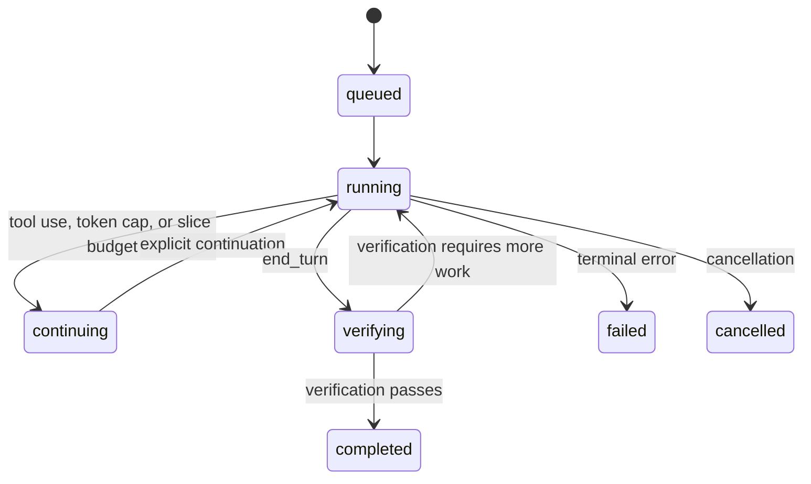

# Durable editor runs

This document is the implementation contract for Ciciro's long-running editor. The
editor remains inside the single-process Next.js application and uses the existing
SQLite database. Work is split into bounded, durable slices so an HTTP request ending
is no longer confused with the editor finishing the author's request.

## Goals

The rollout consists of six related changes:

1. Persist the editor's model transcript, tool pairs, visible output, counters, and
   lifecycle after every model iteration.
2. Add revision-safe structural tools for deleting passage ranges, splitting malformed
   chapter boundaries, and checking for duplicates.
3. Parse editorial intent into an inspect → compare → mutate → verify contract,
   including named source and destination chapters.
4. Verify the requested manuscript end state before reporting completion, while
   allowing a justified no-op when that state already holds.
5. Show and resume durable progress in the client, and route deterministic retrieval
   or mechanical work through the fast lane.
6. Protect the lifecycle and tools with fixture-based regression tests, including the
   originally reported malformed-manuscript scenario.

The first implementation phase establishes item 1 and the lifecycle required by the
remaining items. Structural mutation, intent-specific verification, client
auto-continuation, routing, and the final regression suite are later phases.

## Lifecycle

`queued`, `running`, `continuing`, `verifying`, `completed`, `failed`, and
`cancelled` are durable states. A request may execute at most one bounded slice.
`continuing` is a successful checkpoint, not completion and not a failure.

The only completion path is:

1. the model returns `end_turn`;
2. every tool request in the persisted transcript has a matching result;
3. the active verification policy passes; and
4. the completed state and assistant message are committed.

Phase 1's baseline verifier proves the first two lifecycle invariants. The
intent-aware manuscript checks described below replace/extend that policy in phase 2.
`tool_use`, `max_tokens`, `pause_turn`, a recoverable stream interruption, and slice
budget exhaustion always checkpoint as `continuing`. A refusal or non-recoverable
exception is `failed`.

## Persistence schema

### `EditorRun`

One row owns one author turn. `turnId` is globally unique and is the idempotency key.
The row stores:

- project and user/assistant message references;
- request configuration (`kind`, scope, active chapter, selection, auto mode);
- the complete Anthropic `messages` array as serialized JSON;
- author-visible output;
- status, last stop reason, iteration count, mutation count, and verification result;
- a database lease token and expiry for single-run concurrency exclusion; and
- start, update, completion, and cancellation timestamps.

The serialized model transcript is authoritative when a later request resumes a run.
It contains assistant `tool_use` blocks immediately followed by their user
`tool_result` blocks. Resume never reconstructs these pairs from chat prose.

### `EditorStep`

One append-only row records each model iteration:

- ordinal iteration number;
- model response JSON and tool-result JSON;
- visible text produced by that iteration;
- stop reason, mutation count, and step status; and
- start and finish timestamps.

After each iteration, the step and updated run checkpoint are written in one database
transaction. Tool side effects themselves may already have committed; recording a
mutation count makes that fact visible to later verification.

Large `read_chapter` and `survey_structure` results remain verbatim in the run
transcript for the run's full working lifetime. Existing cross-turn chat compaction is
separate. A later retention pass may archive completed-run retrieval payloads into
`ChatBlob` and replace them with stable references, but it must never do so while the
run can still need them.

## HTTP and stream contract

`POST /api/chat` remains the compatibility endpoint and emits NDJSON. The route is an
adapter: it validates the request, handles the compact-only command, obtains or
creates an `EditorRun`, and asks the runner to execute one slice.

Events are:

- `{"type":"turn","id":turnId,"runId":runId}` identifies the durable run.
- `{"type":"text","v":delta}` appends visible output.
- `{"type":"text","v":fullText,"resume":true}` replaces the client's current seed
  during replay/resume.
- Existing tool and chapter UI events retain their shapes.
- `{"type":"done","status":status,"runId":runId,"stopReason":reason}` closes the
  slice. `status` is a durable run state, not an HTTP-request outcome.

Repeating a request with the same `clientTurnId` returns the same run and never
creates a second user message. A completed run replays its persisted output. A
continuing run resumes its exact transcript when requested with `resumeTurnId` (or
the same client id). If another request owns the unexpired run lease, the adapter
returns `409`; no second generation or tool execution starts.

Disconnecting the client does not cancel server work. Cancellation is an explicit
state transition (API/UI wiring is phase 3): it prevents another slice from starting,
but cannot roll back tool mutations already committed. Expired leases are recoverable
after process death.

## Structural tool contracts (phase 2)

All structural writes accept expected chapter revision values and run transactionally.
On mismatch they return a stale-revision result without mutation.

- `delete_passages`: delete an inclusive paragraph or scene range by stable address,
  return before/after revisions and a refreshed index.
- `split_chapter_at`: dry-run or atomically split an inline boundary such as
  `SurgeonCHAPTER 2`; update/create the destination without losing either side.
- `passage_exists`: chapter-scoped normalized comparison used to prove duplicate,
  missing, and already-satisfied states without mutating.

Manual chapter autosaves use the same revision check, preventing silent overwrites
between the editor and browser.

## Intent and verification (phase 2)

The intent parser produces a structured contract containing source chapters,
destination chapters, inspected evidence, desired operations, and postconditions.
Named chapter indexes are injected into context. Directional language such as
“poorly inserted in chapter 1; add it to chapter 2” must identify chapter 1 as the
source and chapter 2 as the destination.

Before completion, verification re-reads affected revisions and checks the contract:

- malformed inline chapter markers are absent;
- requested source passages are absent;
- destination passages exist exactly as required, without duplicates;
- every mutation is based on the expected revision; and
- an action run has either a successful mutation or evidence that the desired state
  already existed.

Failed checks return the run to `running`/`continuing` with structured evidence for
the next iteration. A no-op completes only when its evidence proves every
postcondition.

## Routing and client behavior

The client renders durable phases, retains pending turns while status is
`continuing`, automatically requests the next slice, and reconciles browser state
with the persisted run after reload. Active leases are polled before another resume
request, and the same turn id is reused for every retry. Failed and cancelled runs
remain visible and are never presented as finished work.

The existing Groq/Haiku fast lane classifies only requests already eligible for
structured mechanical or retrieval routing and suggests the next deterministic
phase. It cannot execute tools or approve completion. Opus remains the editor for
every run; ambiguous editorial work uses high effort with a 16,000-token output
budget, while retrieval and fully specified mechanical routes use low effort with
3,000- and 6,000-token budgets respectively. Routing never weakens the verification
gate.

## Failure and recovery semantics

- Network failure before any model output: retry the model request within the slice.
- Recoverable failure after visible output: checkpoint the output and continuation
  prompt, then return `continuing`.
- Tool failure returned as a tool result: retain the pair and let the model correct
  course in a later iteration.
- Terminal model/runner error: persist `failed`, the safe visible prefix, and error
  metadata. Never heal it into `completed`.
- Process death: the last committed step is authoritative; an expired lease permits
  another request to resume.
- User cancellation: persist `cancelled`; do not start further model iterations.

## Rollout and acceptance criteria

Roll out in three phases:

1. durable runs, strict completion, leases/idempotency, and retained in-run context;
2. revision-safe structural tools plus intent-aware verification;
3. client continuation/routing and the complete lifecycle/tool regression suite.

Phase 1 is accepted when schema generation and type checking pass, duplicate turn ids
cannot create duplicate runs/messages, every iteration checkpoints a resumable
transcript, retrieval results survive across slices, and no path labels token/tool/
slice exhaustion as complete.

Phase 2 is accepted when the malformed boundary can be split and passages moved or
deleted with revision conflicts and duplicates detected, and completion proves the
requested end state.

Phase 3 is accepted when continuation survives reload without duplicate generation,
all lifecycle states are represented honestly, focused regressions pass, and the
reported prompt succeeds against a cloned fixture rather than an author's manuscript.

## Deterministic regression results

Measured locally on August 18, 2026, without a live model call and without reading or
writing an author's project:

- Vitest runs against a newly created temporary SQLite database for every invocation.
  The complete suite passed 23 tests across 6 files in 1.95 seconds of Vitest time
  (4.57 seconds including Prisma schema synchronization and process startup).
- The exact reported prompt and the fused
  `SurgeonCHAPTER 2The cameras...` manuscript class are stored as test fixtures.
  Intent parsing selected chapter 1 as source and chapter 2 as destination.
- The fixture scenario performed one atomic source mutation, advanced source revision
  7 → 8, left destination revision 3 and its HTML bytes unchanged because the passage
  already existed there, and passed every intent-aware completion check.
- A six-iteration mocked `max_tokens` slice persisted six steps and the original
  retrieval tool result, then returned `continuing` with no completion timestamp.
  Duplicate turn preparation produced one run/user message and a second concurrent
  claim was rejected.
- Prisma validation, client generation, and schema push against a temporary database
  completed in 3.21 seconds. TypeScript checking completed in 2.62 seconds. The
  production build completed in 20.10 seconds, including a 5.8-second optimized
  compilation.
