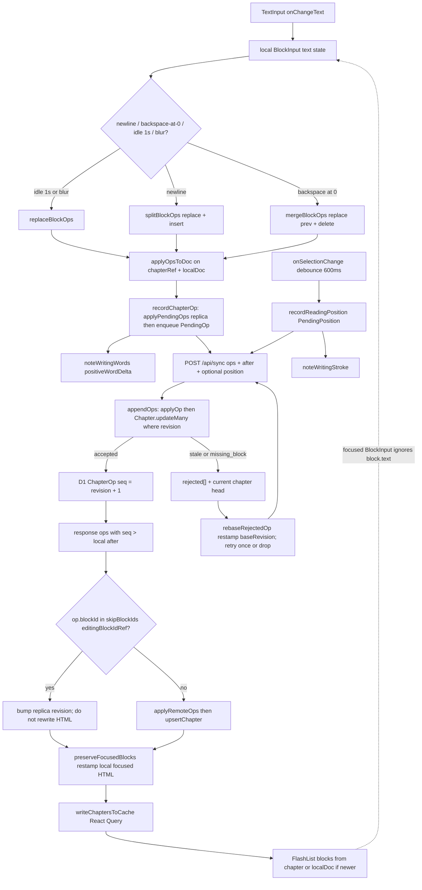
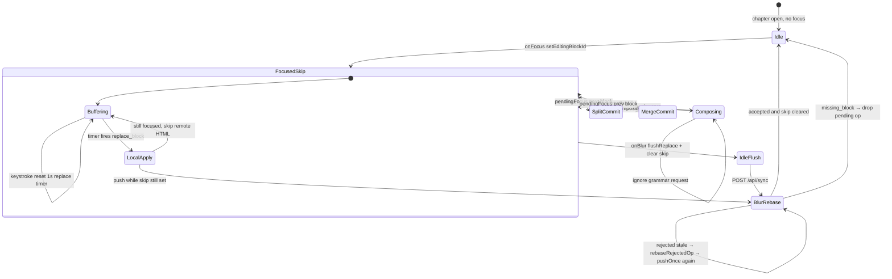
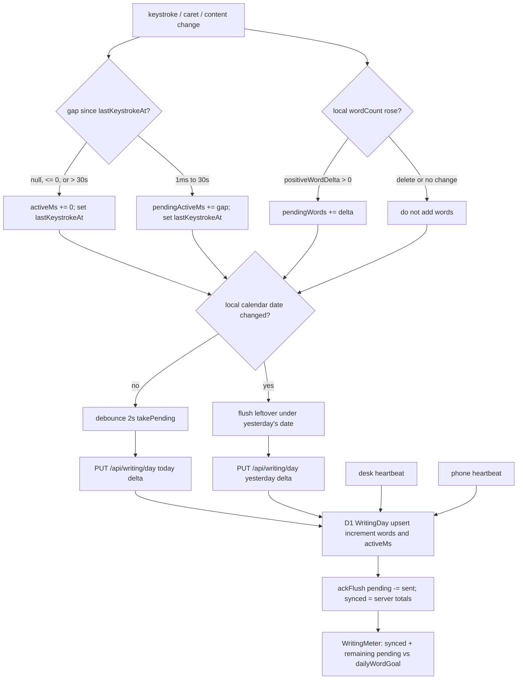

# Mobile editor data and state flows

Mapped from code on `feat/writing-day` (`5cab8f8`, which includes the native editor) plus the in-flight grammar path on `feat/grammar-popups` (`16632e2`). Grammar popups, WritingDay, and the native editor are implemented on those branches — this doc is the race map, not a substitute for them.

Draw these diagrams (or an updated slice) before changing the mobile editor, `/api/sync`, replica merge, grammar `correction` ops, or WritingDay heartbeats. See `.cursor/rules/editor-flow-diagrams.mdc`.

## Source map

| Concern | Code |
| --- | --- |
| Keystroke → ops | `apps/mobile/lib/block-editor.ts`, `apps/mobile/app/project/[id]/manuscript.tsx` |
| Focused-block skip | `apps/mobile/lib/project.tsx` (`editingBlockIdRef`), `use-project-sync.ts`, `sync-merge.ts` |
| Pending → POST `/api/sync` | `apps/mobile/lib/sync-engine.ts`, `src/lib/sync.ts`, `src/app/api/sync/route.ts` |
| D1 CAS + `ChapterOp` | `src/lib/chapter-ops.ts` `appendOps`; `applyOp` in `apps/mobile/lib/manuscript.ts` |
| Desk save | `src/components/Workspace.tsx` patches HTML; `src/lib/chapters.ts` diffs to ops then `appendOps` |
| Grammar (in-flight) | `apps/mobile/lib/grammar.ts`, `GrammarPopup.tsx`, `src/lib/correct.ts`, `POST /api/correct` |
| WritingDay | `apps/mobile/lib/writing-day.ts`, `writing-day-session.tsx`; web `src/lib/writing-day-client.ts`; `PUT /api/writing/day`; Prisma `WritingDay` |

Timings from code: `REPLACE_FLUSH_MS = 1000`, `CARET_FLUSH_MS = 600`, `GRAMMAR_IDLE_MS = 800`, `GRAMMAR_AUTO_ACCEPT_MS = 3000`, `PAUSE_MS = 30_000`, `HEARTBEAT_MS = 2_000`.

---

## 1. Data flow — TextInput to replica (skip focused block)



`syncProject` is per-project single-flight. Pending ops take the push path; otherwise pull. Pull also runs after a successful push so the replica sees desk ops.

Desk is not this loop: Workspace debounce-patches chapter HTML; the server diffs to ops and `appendOps`. Those ops arrive on the phone as the pull arrow above.

---

## 2. State machine — composing / idle / focused-skip / blur-rebase

Phone editor states. `composing` is gated in grammar-popups via `onTextInput` `isComposing`; the native-editor / WritingDay manuscript does not yet pause flushes during IME.



Focused-skip means: `applyRemoteOps` increments revision for ops that touch `editingBlockIdRef`, and `preserveFocusedBlocks` copies the replica's pre-pull HTML for that id onto the new snapshot. The `TextInput` is controlled from its own `text` state while `focused` is true, so a React Query rewrite must not win.

---

## 3. Concurrent correction — author typing vs `actor: correction`

In-flight on `feat/grammar-popups`. `/api/correct` is fail-soft (empty spans if settings off, no key, or Haiku error). It never writes `ChapterOp`. Accept is a normal `replace_block` with `actor: "correction"`. The callout is pinned to the span (measured `onTextLayout`, placed with `placeCallout`) so it scrolls with the paragraph instead of floating on the keyboard. `GrammarLoop` arms a 3s auto-accept; Ignore or typing through the span cancels it. The meter is determinate; `reduceMotion` only coarsens the tick.

```mermaid
sequenceDiagram
  participant Author
  participant Input as BlockInput
  participant Loop as GrammarLoop
  participant Haiku as POST /api/correct
  participant Doc as chapterRef + replica
  participant Sync as POST /api/sync

  Author->>Input: type
  Input->>Loop: onKeystroke abort inflight + dropIfStale
  alt composing
    Loop-->>Haiku: do not request
  else sentence terminator
    Loop->>Haiku: POST immediately
  else idle 800ms
    Loop->>Haiku: POST latest draft
  end
  Haiku-->>Loop: spans against requested text
  Loop->>Loop: matchingSpans live draft vs requested text
  alt no span still at those offsets
    Loop-->>Author: drop popup
  else span intact
    Loop-->>Author: GrammarPopup pinned to span, scrolls with text
    Loop->>Loop: arm 3s auto-accept + progress meter
  end

  alt keep typing through the span
    Author->>Input: type
    Loop->>Loop: matchingSpans empty → drop + cancel auto-accept
  else Ignore
    Loop-->>Author: clear suggestion + cancel auto-accept
  else Accept or 3s elapses
    Input->>Doc: replaceBlockOps live text + actor correction
    Doc->>Sync: PendingOp
    Sync-->>Doc: CAS accept or stale rebase
  end
```

Accept uses `loop.draftOf` (unflushed TextInput) then `replaceBlockOps` on `chapterRef` (last committed HTML). The replace timer for that block is cleared so a stale user flush cannot race the correction op. Auto-accept lives on `GrammarLoop`, not popup mount, so FlashList recycle cannot cancel the 3s clock. Accept of a stale span is still a no-op.

---

## 4. WritingDay — keystroke to merged daily totals

Words are **local authoring only**. Pulling desk ops does not call `noteWritingWords`. Active ms is the gap between strokes, zeroed after a 30s pause. Desk (`Workspace` + `writing-day-client`) and phone (`use-project-sync` + `writing-day-session`) each heartbeat deltas; D1 **increments** on the same `userId + YYYY-MM-DD`.



`writingDayKey` is the **device timezone** calendar day. There is no streak. Settings `dailyWordGoal` is display-only.

---

## Failure modes to catch before they happen

### CAS stale

`applyOp` returns `stale` unless `op.baseRevision === doc.revision`. D1 then `updateMany` where `revision` still matches; a concurrent desk patch or another device op loses the race and the op is `rejected`.

Mobile `handleRejected` writes the server chapter head, `rebaseRejectedOp` restamps `baseRevision`, and `pushProject` retries **once**. If the block is gone, the pending op is **dropped** — the author's unflushed TextInput may still hold the lost text until blur.

Split/merge emit two ops with sequential `baseRevision`s. If the first is accepted and the second is stale, only the second rebases. If the first is rejected, the second's base is now wrong too.

### IME / split

`onChangeText` treats the first `\n` as `splitBlockOps` and strips further newlines. During IME, composition events can look like text changes; grammar-popups abort `/api/correct` while `isComposing` but the native editor still flushes replace ops on the 1s timer. A composition commit that includes a newline will split mid-IME. `onKeyPress` Backspace-at-0 can merge before the IME buffer is final.

### Correction span mismatch

Spans are offsets into the **requested** string. `matchingSpans` requires that exact slice to still sit at the same offsets in the live draft. Typing through the range drops the popup and cancels the 3s auto-accept. Accept of a stale popup is a no-op. Ignore clears the suggestion the same way.

If accept runs against `chapterRef` that is behind the draft, `replace_block` still uploads the **full live text** (draft + span), which is correct — unless a concurrent skip-pull advanced `chapterRef.revision` via `chapter.revision >= chapterRef.current.revision` and replaced content with a replica that omitted unflushed typing. Blur-then-flush is the recovery; accepting grammar in that window can write an older committed block plus the span and **lose later keystrokes**.

A desk (or other-device) `correction` op that touches the focused block is skipped locally. On blur, `flushReplace` pushes the author's buffer and can **clobber** that correction.

### Double-count words

`takePending` snapshots pending but does not zero it; `ackFlush` subtracts after a heartbeat that returns `day`. If `PUT` succeeds and the client does not ack (non-OK parse, missing `day`, thrown after write), the next heartbeat sends the same delta and D1 increments again.

Desk and phone are supposed to add **independent** new words. Counting pulled replica `wordCount` jumps would double-count the other device — that is why only `recordOp` / Workspace `onContentChange` call `noteWritingWords`. Rebase/retry must not call `recordOp` again (today it does not).

Midnight `shiftDate` plus timezone skew: the same UTC typing session can land on two `YYYY-MM-DD` keys across desk and phone.

### Clobber focused TextInput

The skip list is a **single** `editingBlockIdRef`. A pull that rewrites a focused block without skip (ref not set yet, or focus moved to the split's new id while remote ops still name the old id) will update React Query `content`. `BlockInput` applies `block.text` when `!focused`. If `focused` flickers during `pendingFocus` / FlashList recycle, the controlled value jumps and the caret resets.

`preserveFocusedBlocks` only restamps HTML for ids still present in the remote doc. A remote `delete_block` of the focused id is skipped at apply time (revision bumps, HTML kept), so replica revision can claim the delete happened while the TextInput still shows the paragraph — blur then `replace_block` / missing_block drop.

Do not apply remote HTML to the focused block "to stay in sync." Flush on blur, then rebase.
