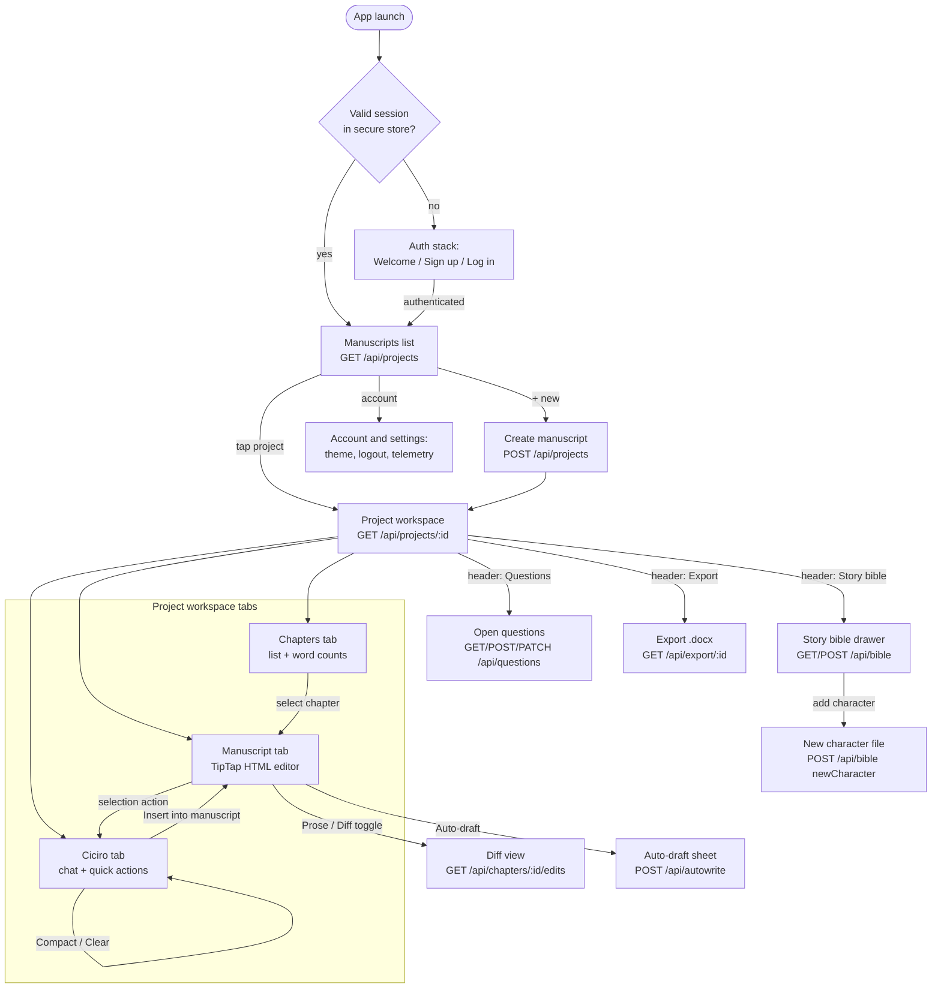
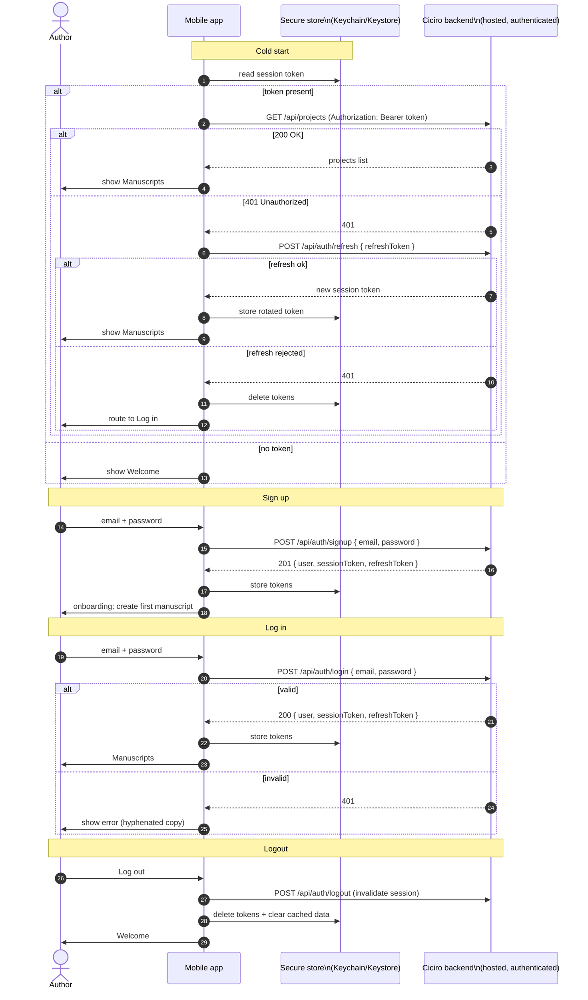
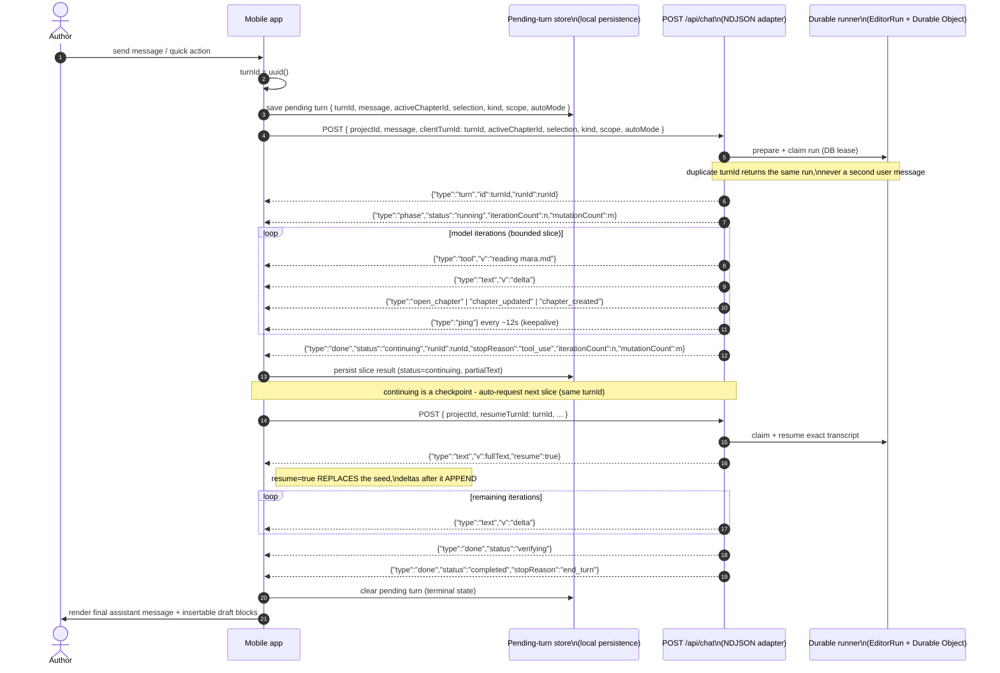
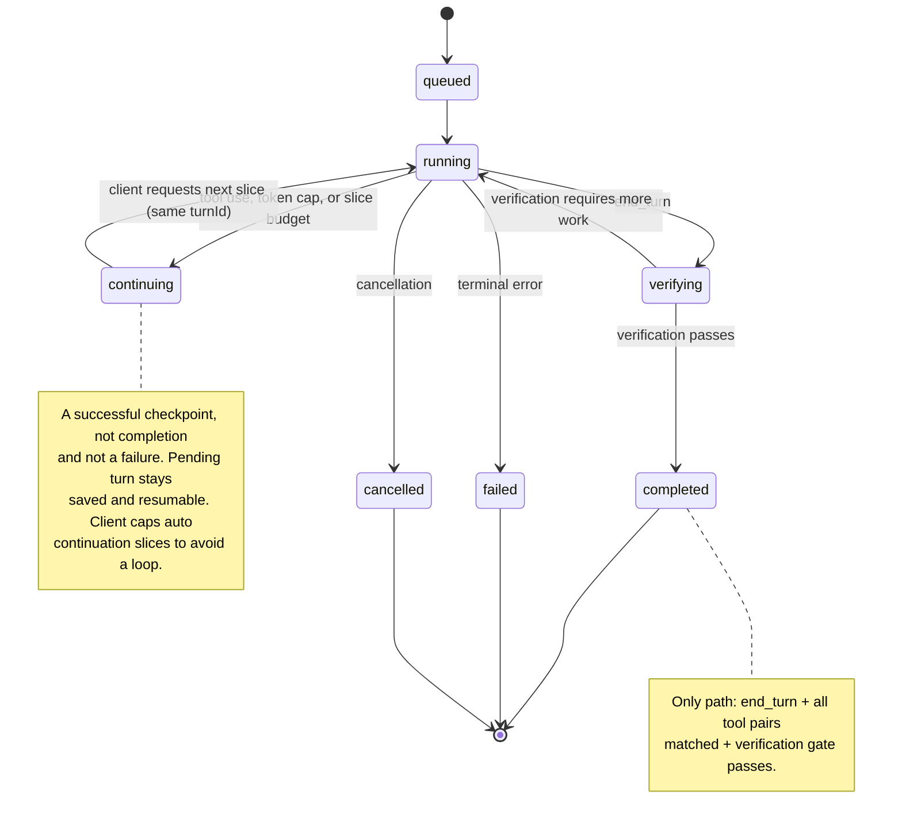
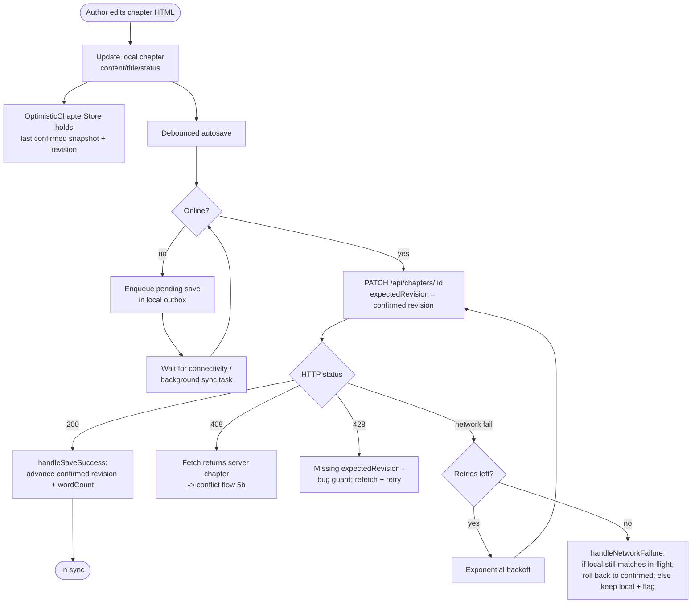
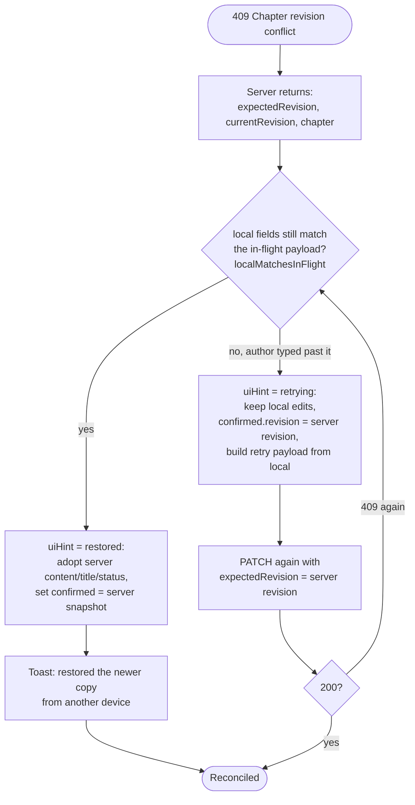
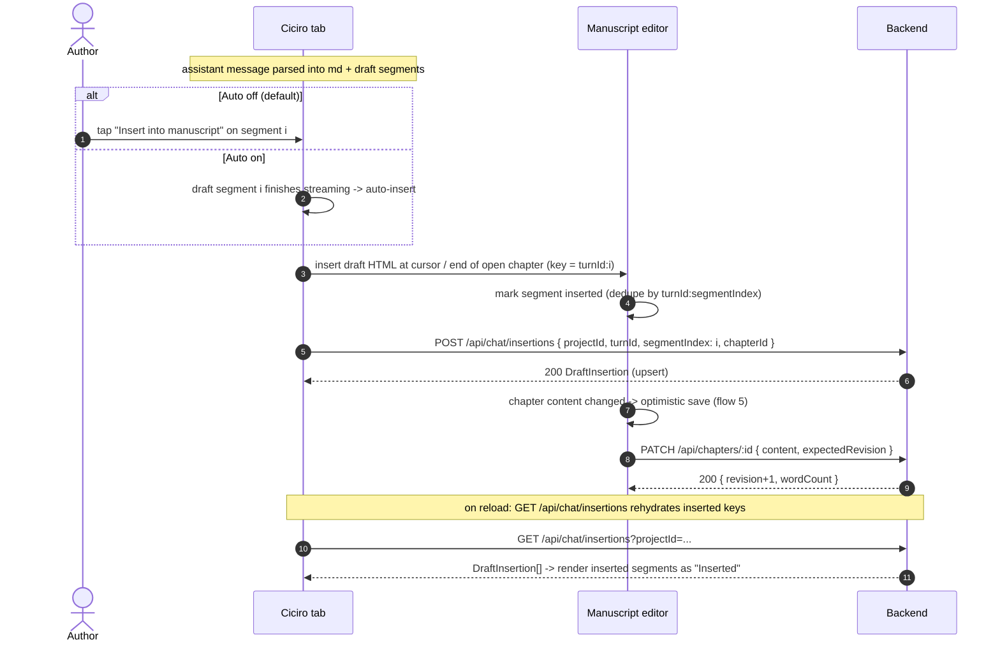
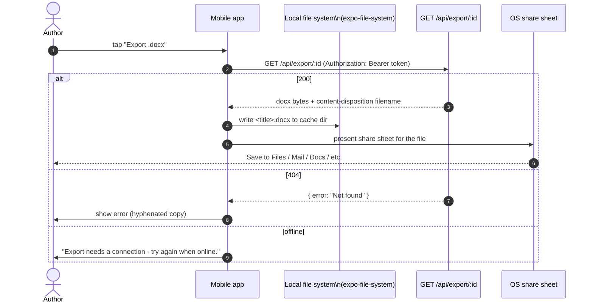

# Ciciro mobile - application flow diagrams

This document is the flow reference for the Ciciro mobile app. Every diagram is
Mermaid embedded in markdown. It is grounded in the real backend: the endpoints
under `src/app/api/**`, the durable-run lifecycle in
[`../editor-agent-runs.md`](../editor-agent-runs.md), the data model in
`prisma/schema.prisma`, and the optimistic-save contract in
`src/lib/optimistic-chapter.ts`.

See also: [README](README.md) (framework decision) and
[technical-spec](technical-spec.md) (libraries, API shapes, offline strategy).

Contents:

1. [App navigation / screen map](#1-app-navigation--screen-map)
2. [Authentication & onboarding](#2-authentication--onboarding)
3. [Manuscript list to workspace](#3-manuscript-list-to-workspace)
4. [The durable editor chat turn (most important)](#4-the-durable-editor-chat-turn-most-important)
5. [Offline editing + sync / conflict resolution](#5-offline-editing--sync--conflict-resolution)
6. [Draft insertion / accept-draft](#6-draft-insertion--accept-draft)
7. [DOCX export / share](#7-docx-export--share)

---

## 1. App navigation / screen map

Phone-first navigation. The web's three-pane Workspace (chapters / manuscript /
Ciciro chat) collapses into a project-scoped tab bar, with the story bible,
questions, and export reached from the workspace header or a sheet.



---

## 2. Authentication & onboarding

Targets the hosted backend's auth system (email/password + `User`/`Session`
models the parent agent is adding). The app stores the session token in the
platform secure enclave (Keychain / Keystore via `expo-secure-store`) and sends
it as a bearer token / session cookie on every API call. The `ANTHROPIC_API_KEY`
is never on device - the editor and drafter run server-side.



---

## 3. Manuscript list to workspace

Opening a project loads its chapters, characters, and plot points in one call
(`GET /api/projects/:id`), then hydrates chat and durable-run state
(`GET /api/chat?projectId=...`) so the workspace can resume any unfinished turn.

```mermaid
flowchart TD
  Start([Manuscripts list]) --> ListCall[GET /api/projects\nprojects + chapter counts]
  ListCall --> Choice{Author action}

  Choice -->|create| Create[POST /api/projects\ntitle/author/genre/logline]
  Create --> ServerNew[(Project + Chapter 1\ncreated server-side)]
  ServerNew --> Open

  Choice -->|open existing| Open[GET /api/projects/:id]
  Open --> Loaded[(chapters ordered by order,\ncharacters, plotPoints)]
  Loaded --> Cache[Write to local cache\nWatermelonDB/SQLite]

  Cache --> Hydrate[GET /api/chat?projectId=...\nmessages + EditorRun[]]
  Hydrate --> Resume{Any run in\nqueued/running/\ncontinuing/verifying?}
  Resume -->|yes| ResumeTurn[Restore pending turn,\nauto-resume same turnId]
  Resume -->|no| Idle[Workspace idle]

  ResumeTurn --> Workspace[Show workspace:\nManuscript tab active]
  Idle --> Workspace

  Workspace --> OpenCh[Open first/last-edited chapter\ncontent = TipTap HTML]
  Workspace --> Insertions[GET /api/chat/insertions\nmark already-inserted drafts]
```

---

## 4. The durable editor chat turn (most important)

This is the heart of the app and must be faithful to
[`../editor-agent-runs.md`](../editor-agent-runs.md). One author turn is a
persisted `EditorRun` keyed by a client-generated `turnId` (the idempotency key).
`POST /api/chat` executes one bounded slice and streams NDJSON; a slice that ends
on tool use, the token cap, or its iteration budget checkpoints as `continuing`
(a success, never completion). The client keeps requesting slices with the same
`turnId` until a terminal state (`completed` / `failed` / `cancelled`).

### 4a. Stream + resume sequence



### 4b. Reconnect / background / drop recovery

Mobile adds transitions the web client also handles: OS backgrounding, radio
loss, and app kill. The recovery rule is always the same - **reuse the same
`turnId`**, poll `GET /api/chat` to catch a finish-race, then resume from the
persisted transcript (or re-send fresh with the same `clientTurnId` if the POST
never landed).

```mermaid
sequenceDiagram
  autonumber
  participant App as Mobile app
  participant OS as OS / network
  participant API as Ciciro backend

  Note over App,API: streaming a slice...
  OS-->>App: app backgrounded / network dropped / stream stalls (over 50s no bytes)
  App->>App: mark conn = reconnecting; keep pending turn saved
  Note over App: disconnect is NOT cancellation - server slice keeps running

  App->>OS: wait for online / foreground
  OS-->>App: online / foreground
  App->>API: GET /api/chat?projectId=... (poll for turnId assistant + run status)
  alt run terminal (completed/failed/cancelled)
    API-->>App: run.status terminal + visibleOutput
    App->>App: adopt final text, clear pending turn
  else run still running/verifying (lease held)
    API-->>App: status running (another request owns the lease)
    App->>App: keep polling, do NOT start a duplicate slice
  else run continuing / needs a new slice
    App->>API: POST { resumeTurnId: turnId, continueFrom: partialText, ... }
    alt 404 (POST never landed)
      API-->>App: 404 Nothing to resume
      App->>API: POST { message, clientTurnId: turnId } (fresh, same id)
    else 409 (lease busy)
      API-->>App: 409 already executing
      App->>App: back off, poll again
    else 200
      API-->>App: NDJSON stream (resume=true seed, then deltas)
    end
  end
```

### 4c. Durable run lifecycle (state diagram)

Mirrors the lifecycle in [`../editor-agent-runs.md`](../editor-agent-runs.md).
The app renders each state honestly (phase chip: Queued / Editing / Continuing /
Verifying / Completed / Failed / Cancelled) and never labels token/tool/slice
exhaustion as complete.



---

## 5. Offline editing + sync / conflict resolution

Grounded in the existing optimistic-save model: `Chapter.revision` is an
optimistic-concurrency token, `PATCH /api/chapters/:id` requires
`expectedRevision` (returns `428` if missing), and returns `409` with the current
server chapter on a stale revision. The mobile app reuses the exact resolution
logic from `src/lib/optimistic-chapter.ts` (`handleSaveSuccess`,
`handle409Conflict`, `handleNetworkFailure`).

### 5a. Optimistic save + sync



### 5b. 409 revision conflict resolution



---

## 6. Draft insertion / accept-draft

The editor hands prose as `<draft>` blocks inside the assistant message. The
author inserts one into the open chapter; with **Auto on**, finished drafts
insert automatically. Each insertion is recorded durably by
`(turnId, segmentIndex)` via `POST /api/chat/insertions` so it survives streaming
temp ids and reloads (`DraftInsertion` unique on `turnId_segmentIndex`).



---

## 7. DOCX export / share

Export renders a Shunn-style `.docx` server-side (`GET /api/export/:id`,
`src/lib/docx.ts`). On mobile the binary is downloaded to app storage and handed
to the native share sheet (`expo-sharing`) so the author can save to Files/Drive,
email, or open in a word processor.



---

Next: read the [technical specifications](technical-spec.md) for the concrete
libraries, API request/response shapes, offline data model, rich-text approach,
security, streaming internals, testing, and the phased rollout plan.
