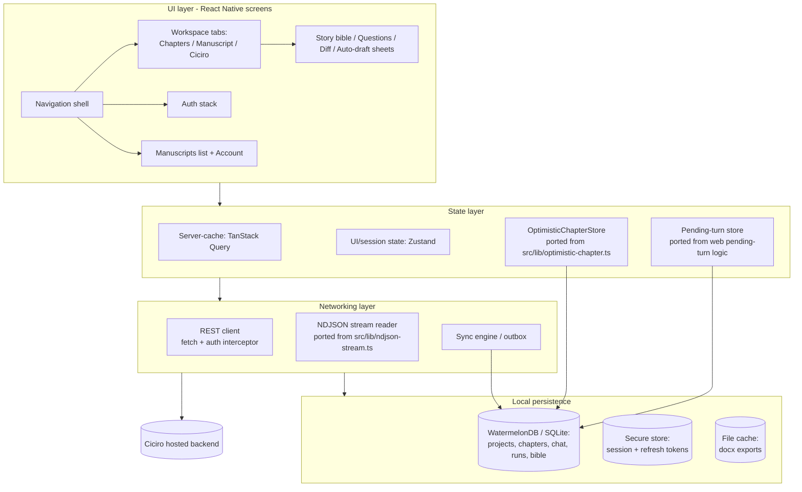
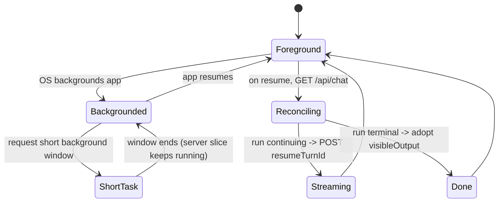

# Ciciro mobile - technical specification

This is the engineering contract for the Ciciro mobile app. It is grounded in the
existing backend and web client: the endpoints under `src/app/api/**`, the data
model in `prisma/schema.prisma`, the durable-run contract in
[`../editor-agent-runs.md`](../editor-agent-runs.md), and the reusable client
logic in `src/lib/optimistic-chapter.ts`, `src/lib/ndjson-stream.ts`, and
`src/lib/theme.ts`.

See also: [README](README.md) (goals, non-goals, framework decision),
[flows.md](flows.md) (diagrams), and
[Writing goals, reminders, and rewards](../gamification.md) (habit goals,
reminder cadences, streaks, and bonus credits). This spec assumes the hosted,
authenticated, multi-user backend (email/password + `User`/`Session`, durable
runs backed by a Cloudflare Durable Objects coordinator, hosted via
`@opennextjs/cloudflare`).

Contents:

1. [Architecture overview](#1-architecture-overview)
2. [Framework and key libraries](#2-framework-and-key-libraries)
3. [API integration](#3-api-integration)
4. [Local data model & offline strategy](#4-local-data-model--offline-strategy)
5. [Rich text / editor on mobile](#5-rich-text--editor-on-mobile)
6. [Auth & security](#6-auth--security)
7. [Streaming & durable-run handling on mobile](#7-streaming--durable-run-handling-on-mobile)
8. [Push notifications & export/share](#8-push-notifications--exportshare)
9. [Non-functional requirements](#9-non-functional-requirements)
10. [Testing strategy](#10-testing-strategy)
11. [Phased delivery / rollout](#11-phased-delivery--rollout)
12. [Open questions & risks](#12-open-questions--risks)

---

## 1. Architecture overview

The app is layered so that the two hard parts - durable-run streaming and
revision-based optimistic saves - are pure TypeScript that can be shared with the
web repo.



**Module breakdown**

- `app/` - screens and navigation (Expo Router): auth stack, manuscripts list,
  project workspace (Chapters / Manuscript / Ciciro tabs), bible, questions,
  diff, auto-draft, account.
- `features/` - one folder per domain: `projects`, `chapters`, `chat`, `bible`,
  `questions`, `export`, `auth`. Each owns its queries, mutations, and screens.
- `lib/net/` - `apiClient` (auth interceptor, base URL, retry/backoff), `ndjson`
  (ported stream reader), `sync` (outbox + background task).
- `lib/durable/` - `pendingTurn` store and `turnRunner` (the slice loop, resume,
  and continuation cap) - a direct port of the web `ChatPanel` runner logic.
- `lib/optimistic/` - `OptimisticChapterStore` and the `handleSaveSuccess` /
  `handle409Conflict` / `handleNetworkFailure` helpers, shared verbatim with the
  web repo.
- `lib/db/` - local schema, migrations, and repositories.
- `lib/theme/` - the six themes from `src/lib/theme.ts` mapped to RN tokens.

**Shared-code strategy.** The framework-agnostic logic (`ndjson-stream.ts`,
`optimistic-chapter.ts`, `types.ts`, `segments.ts`, `theme.ts`) is extracted into
a small workspace package (for example `@ciciro/core`) imported by both the web
app and the mobile app, so the durable-run contract cannot silently diverge.

---

## 2. Framework and key libraries

**Framework: React Native + Expo (TypeScript), dev/config build** (not Expo Go,
because native modules are required). Rationale is in the
[README](README.md#framework-choice-react-native--expo).

| Concern | Library | Why |
|---|---|---|
| Navigation | **Expo Router** (React Navigation) | File-based routing that mirrors the web's route structure; native stack + tabs for the workspace panes. |
| Server cache | **TanStack Query** | Declarative caching, background refetch, and mutation retries for the REST endpoints; pairs with an offline persister. |
| UI/session state | **Zustand** | Small, hook-based store for streaming state, active chapter, connection banner - mirrors the local `useState` in `ChatPanel`. |
| Local database | **WatermelonDB** (SQLite) | Reactive, offline-first store for projects/chapters/chat/runs; observable queries drive the UI. `expo-sqlite` is the fallback if a lighter layer is preferred. |
| Secure storage | **expo-secure-store** | Session + refresh tokens in iOS Keychain / Android Keystore. |
| Streaming fetch | **expo/fetch** (`ReadableStream`) or **react-native-fetch-api** + `TextDecoder` polyfill | Incremental NDJSON reads on mobile; the ported reader consumes `response.body.getReader()`. |
| Rich text | **WebView-hosted ProseMirror/TipTap** (`react-native-webview`) | HTML parity with `Chapter.content` (see [section 5](#5-rich-text--editor-on-mobile)). |
| Markdown | **react-native-markdown-display** | Renders assistant chat prose (the web uses `react-markdown` + `remark-gfm`). |
| DOCX share | **expo-file-system** + **expo-sharing** | Download the export and hand it to the OS share sheet. |
| Background sync | **expo-task-manager** + **expo-background-fetch** | Flush the save outbox and advance `continuing` runs when the app is backgrounded. |
| Push | **expo-notifications** | Daily writing reminder (local schedule) plus later remote push for habit nudges and long-running / auto-draft run completion. See [gamification.md](../gamification.md#5-reminders). |
| Errors/telemetry | **Sentry** (`@sentry/react-native`) | Crash + error reporting, breadcrumb trail for stream lifecycle. |

---

## 3. API integration

All requests carry the session token (`Authorization: Bearer <token>`, or the
session cookie the hosted backend issues) via a single auth interceptor that
handles `401 -> refresh -> retry once -> logout`. Base URL is the hosted
deployment. The endpoints below are the real surface derived from
`src/app/api/**`.

### 3.1 Endpoint catalog

| Method & path | Purpose | Request (high level) | Response |
|---|---|---|---|
| `GET /api/projects` | List manuscripts | - | `Project[]` incl. `_count.chapters`, newest `updatedAt` first |
| `POST /api/projects` | Create manuscript + Chapter 1 | `{ title?, author?, genre?, logline? }` | `201 Project` (with `chapters`) |
| `GET /api/projects/:id` | Full project | - | `Project` incl. ordered `chapters`, `characters`, `plotPoints`; `404` if missing |
| `PATCH /api/projects/:id` | Edit bible/meta fields | subset of `title, author, genre, logline, synopsis, theme, pov, notes` | `Project` |
| `DELETE /api/projects/:id` | Delete manuscript | - | `{ ok: true }` |
| `POST /api/chapters` | Add chapter (appended) | `{ projectId, title? }` | `201 Chapter` |
| `PATCH /api/chapters/:id` | Save chapter | `{ expectedRevision, content?, title?, summary?, status?, order? }` | `Chapter` (revision+1); `409` conflict; `428` if `expectedRevision` missing |
| `DELETE /api/chapters/:id` | Delete + renumber | - | `{ ok: true }` |
| `GET /api/chapters/:id/edits` | Editor find/replace pairs for diff | - | `ManuscriptEdit[]` (newest 30) |
| `GET /api/bible?projectId=...` | List bible files (index) | - | `{ path, summary, ... }[]` |
| `GET /api/bible?projectId=...&path=x.md` | Read one bible file | - | `{ path, content }` |
| `POST /api/bible` | Write file / add character | `{ projectId, path, content }` or `{ projectId, newCharacter }` | `{ ok }` / `201 { path, content }` |
| `POST /api/chat` | Durable editor turn (NDJSON) | see [3.2](#32-the-ndjson-chat-endpoint) | `application/x-ndjson` stream (or JSON `409`/error) |
| `GET /api/chat?projectId=...` | Load chat + run summaries | - | `{ messages: ChatMessage[], runs: EditorRun[] }` |
| `DELETE /api/chat?projectId=...` | Clear chat + runs | - | `{ ok: true }` |
| `POST /api/chat/insertions` | Record a draft insertion | `{ projectId, turnId, segmentIndex, chapterId }` | `DraftInsertion` (upsert) |
| `GET /api/chat/insertions?projectId=...` | List insertions | - | `DraftInsertion[]` |
| `POST /api/autowrite` | Autonomous chapter draft (NDJSON) | `{ projectId, chapterId, targetWords?, guidance? }` | `application/x-ndjson` stream |
| `POST /api/characters` | Add character (legacy seed table) | `{ projectId, name, role?, description?, arc?, notes? }` | `201 Character` |
| `POST /api/plotpoints` | Add plot point | `{ projectId, title, description?, type?, status?, chapterId? }` | `201 PlotPoint` |
| `PATCH`/`DELETE /api/plotpoints/:id` | Edit / remove plot point | fields / - | `PlotPoint` / `{ ok }` |
| `GET /api/questions?projectId=...[&status=open]` | List open questions | - | `OpenQuestion[]` |
| `POST /api/questions` | Create question | `{ projectId, question, provisional?, affects?, chapterId? }` | `201 OpenQuestion` |
| `PATCH`/`DELETE /api/questions/:id` | Answer/resolve / remove | `answer, status, resolution, ...` / - | `OpenQuestion` / `{ ok }` |
| `GET /api/export/:id` | Download `.docx` | - | `docx` bytes + `content-disposition` filename |
| `POST /api/auth/*` | Signup / login / refresh / logout (parent agent) | credentials / refresh token | session + refresh tokens |

> Note: `Character` and `PlotPoint` are the legacy DB seed tables; the live story
> bible is markdown accessed through `/api/bible`. The app's primary bible UI
> targets `/api/bible`, matching the web app.

### 3.2 The NDJSON chat endpoint

`POST /api/chat` is the durable runner adapter. Request body fields (from
`EditorRunInput`):

- Fresh send: `{ projectId, message, clientTurnId, activeChapterId, selection, kind, scope, autoMode }`.
- Resume: `{ projectId, resumeTurnId, continueFrom?, activeChapterId, selection, kind, scope, autoMode }`.
- Compact only: `{ projectId, compactOnly: true }` (returns JSON, not a stream).
- `kind` is one of `chat | action | autowrite | compact | reconcile`; `scope` is
  `selection | chapter | book`.

Stream events (NDJSON, one JSON object per line), matching
`src/lib/ndjson-stream.ts` and [`../editor-agent-runs.md`](../editor-agent-runs.md):

- `{"type":"turn","id":turnId,"runId":runId}` - identifies the durable run.
- `{"type":"phase","status":<state>,"runId","stopReason","iterationCount","mutationCount"}`.
- `{"type":"text","v":delta}` - append to the visible bubble.
- `{"type":"text","v":fullText,"resume":true}` - **replace** the current seed
  (used on replay/resume), then subsequent deltas append.
- `{"type":"tool","v":line}` - backstage trace line (for example "reading mara.md").
- `{"type":"open_chapter"|"chapter_created"|"chapter_updated", ...}` - live UI
  events; the app switches/refreshes the affected chapter.
- `{"type":"ping"}` - ~12s keepalive; resets the stall timer, not rendered.
- `{"type":"done","status":<state>,"runId","stopReason","iterationCount","mutationCount"}`
  - closes the slice. `status` is a durable run state, not an HTTP outcome.

Idempotency and concurrency:

- Reusing `clientTurnId`/`resumeTurnId` returns the same run and never creates a
  second user message.
- A completed/failed/cancelled run **replays** its persisted `visibleOutput`
  (seed with `resume:true`, then `done`).
- If another request holds the unexpired lease, the adapter returns JSON `409`;
  the app backs off and polls rather than starting a second generation.
- `404` on resume means the original POST never landed - re-send fresh with the
  same `clientTurnId`.

---

## 4. Local data model & offline strategy

### 4.1 What is cached

A local WatermelonDB/SQLite mirror of the server rows the app needs offline,
scoped per authenticated user:

- **projects** - id, title, author, genre, logline, synopsis, theme, pov, notes,
  updatedAt, chapterCount.
- **chapters** - id, projectId, title, order, `content` (TipTap HTML), summary,
  status, wordCount, **revision**, plus local-only `dirty` and `pendingPayload`.
- **chat_messages** - id, projectId, role, content, kind, turnId, status,
  createdAt (the read model of `ChatMessage`).
- **editor_runs** - id, projectId, turnId, status, visibleOutput, stopReason,
  iterationCount, mutationCount (a compact mirror of `EditorRun` from
  `GET /api/chat`).
- **draft_insertions** - `(turnId, segmentIndex, chapterId)` so inserted drafts
  render as "Inserted" after reload.
- **bible_files** - path + content + one-line summary index (cache of
  `/api/bible`).
- **open_questions**, **plot_points** - cached lists for offline viewing.
- **outbox** - queued mutations (chapter saves, question answers, insertions)
  awaiting connectivity.

Chat/runs are the source of truth on the server; the local mirror exists for fast
cold-start and to resume a pending turn. The `ANTHROPIC_API_KEY` and any drafter
transcripts are never stored on device.

### 4.2 Optimistic concurrency & conflict handling

Chapter writes reuse the exact contract already implemented in
`src/lib/optimistic-chapter.ts`:

- The app keeps a per-chapter **confirmed snapshot** (`content`, `title`,
  `status`, `revision`, `wordCount`) in `OptimisticChapterStore`.
- Every `PATCH /api/chapters/:id` sends `expectedRevision = confirmed.revision`.
  Omitting it is a client bug (`428`).
- `200` -> `handleSaveSuccess` advances the confirmed snapshot to the returned
  revision/wordCount.
- `409` -> `handle409Conflict`:
  - if local still matches the in-flight payload (`localMatchesInFlight`), adopt
    the server copy (`uiHint: "restored"`) - another device won;
  - otherwise keep the author's newer local edits, set `confirmed.revision` to the
    server revision, and retry with `buildRetryPayload` (`uiHint: "retrying"`).
- Network failure after retries -> `handleNetworkFailure`: roll back the
  in-flight fields only if local still matches what was sent, else keep local and
  flag the row dirty for the next sync.

The same revision check protects the editor's structural tools server-side (phase
2), so manual mobile autosaves and editor mutations cannot silently overwrite each
other.

### 4.3 Background sync

```mermaid
sequenceDiagram
  autonumber
  participant App as App / background task
  participant OB as Outbox (SQLite)
  participant API as Backend
  App->>OB: read pending mutations (ordered)
  loop each mutation
    App->>API: PATCH/POST with expectedRevision / turnId
    alt 200
      API-->>App: server row
      App->>OB: remove; update confirmed snapshot
    else 409
      API-->>App: server chapter
      App->>App: run handle409Conflict; requeue retry payload if needed
    else offline / 5xx
      App->>OB: keep; exponential backoff
    end
  end
```

Sync is triggered on: app foreground, connectivity regained (`waitForOnline`
equivalent), a debounced timer, and an `expo-background-fetch` job. Ordering is
per-chapter to avoid revision thrash. Unfinished durable turns are advanced by the
turn runner (see [section 7](#7-streaming--durable-run-handling-on-mobile)), not
the plain outbox.

---

## 5. Rich text / editor on mobile

The web stores TipTap/ProseMirror **HTML** in `Chapter.content` (see
`src/components/Editor.tsx`). Word count is derived server-side via
`htmlToText` + `countWords`, and the editor's corrections are recorded as
`find`/`replace` pairs (`ManuscriptEdit`) for the diff view. Mobile must preserve
that HTML exactly so a chapter round-trips between web and mobile without loss.

**Primary approach: WebView-hosted ProseMirror (TipTap) editor.**

- A `react-native-webview` hosts the same TipTap schema/extensions as the web
  `Editor`, bundled as a local HTML asset (no network needed to open the editor).
- The native side sends the chapter HTML in; the WebView emits change events
  (debounced) back over the JS bridge with the updated HTML and a computed word
  count. Native persists via the optimistic save flow.
- Selection is bridged out so selection-scoped quick actions ("Line edit
  selection", "Tighten dialogue") work exactly as on web (`getSelection()`), and
  the "Move to / Find the spot" selection bar can post the same prompts.
- The **Diff** view fetches `GET /api/chapters/:id/edits` and renders the
  find/replace pairs, matching `DiffView`/`src/components/DiffView.tsx`.

**Why WebView over a native editor first:** it guarantees byte-for-byte parity
with the ProseMirror HTML and reuses the existing schema, avoiding a second
rich-text model that could emit divergent HTML. The cost is bridge latency and
some keyboard-handling polish.

**Fallback / roadmap:** a native RN editor (for example `10tap-editor`, itself a
TipTap-on-WebView wrapper, or a fully native editor with an HTML
serializer/parser validated against the ProseMirror schema). Any native path must
pass a round-trip fixture test: `parse(serialize(html)) === html` for the schema
Ciciro uses, and must reproduce `#` scene breaks that DOCX export depends on.

For **read-only** rendering (chapter previews in the Chapters tab, export
preview) a lightweight HTML renderer is enough; the heavy WebView editor mounts
only on the Manuscript tab.

---

## 6. Auth & security

- **Session storage.** Session and refresh tokens live in `expo-secure-store`
  (iOS Keychain, Android Keystore/EncryptedSharedPreferences). Never in
  AsyncStorage, never in the WatermelonDB mirror.
- **Transport.** HTTPS only; certificate defaults enforced. The auth interceptor
  attaches the bearer token / session cookie to every request.
- **Refresh & logout.** On `401`, attempt one silent refresh
  (`POST /api/auth/refresh`); on success, rotate the stored token and retry the
  original request once; on failure, wipe tokens + cached user data and route to
  Log in. Explicit logout calls `POST /api/auth/logout`, clears the secure store,
  and clears the per-user local database.
- **Model key isolation.** The `ANTHROPIC_API_KEY` is server-side only (used by
  `getAnthropic()` in `src/lib/anthropic.ts`). The app never sees it and never
  calls Anthropic directly - all model work is behind `/api/chat` and
  `/api/autowrite`.
- **Multi-user scoping.** Every cached row is namespaced by user id; switching
  accounts (or logout) clears the namespace so one author never sees another's
  manuscripts. Server authorization remains the source of truth.
- **WebView hardening.** The editor WebView loads a local asset with a strict CSP
  and no remote origin; the JS bridge accepts only the known message shapes
  (chapter HTML, selection, word count).
- **At-rest.** Optionally gate app open behind biometrics (`expo-local-
  authentication`) and enable SQLite encryption (SQLCipher) for the manuscript
  cache as a later hardening step.

---

## 7. Streaming & durable-run handling on mobile

The turn runner is a direct port of the web `ChatPanel` runner + `pending-turn`
logic, using the ported `readNdjsonStream` from `src/lib/ndjson-stream.ts`.

**Consuming the stream.** `fetch` returns `response.body` as a `ReadableStream`;
the reader decodes UTF-8 chunks, splits on `\n`, and dispatches each JSON line to
the event handler. A **stall timer** (no bytes for ~50s) cancels the read and
triggers reconnect, since a half-open mobile socket can otherwise hang forever.
`ping` events reset the stall timer. Backpressure is natural: the app reads at its
own pace via `reader.read()`, and only the small visible-text accumulator and the
tool-trace list are kept in memory (large retrieval payloads stay server-side in
the run transcript).

**Resume with the same `turnId`.** The client-generated `turnId` (a UUID) is the
idempotency key and is persisted in the pending-turn store before the first POST.
On any interruption the app reuses it: it polls `GET /api/chat` to catch a
finish-race, then either adopts a terminal run's `visibleOutput`, keeps polling
while another request holds the lease, or POSTs `resumeTurnId` to continue from
the exact persisted transcript. A `resume:true` text event replaces the local
seed; later deltas append.

**Continuation loop.** When a slice returns `done: continuing`, the runner
persists the checkpoint and automatically requests the next slice (same
`turnId`), up to a `MAX_CONTINUATION_SLICES` cap (mirroring the web's guard so a
stuck verification gate cannot loop forever). Only a terminal status
(`completed` / `failed` / `cancelled`) clears the pending turn.

**Background / foreground transitions.**



- Disconnect is **not** cancellation - the server slice keeps running and
  checkpoints (per [`../editor-agent-runs.md`](../editor-agent-runs.md)). The app
  never assumes work stopped just because the socket closed.
- On foreground, the app reconciles against the authoritative run state before
  starting any new slice, so a run finished while backgrounded is adopted rather
  than regenerated.
- Network drops map to the `continuing` checkpoint model: retry the model request
  within the slice if no output yet; otherwise checkpoint the partial and resume.
- Cancellation is an explicit state transition; the app surfaces a Cancel control
  (phase 3 API) and never presents `failed`/`cancelled` as finished work.

**Auto-draft.** `POST /api/autowrite` streams the same NDJSON shape for an
unattended chapter pass; the app renders progress in the Auto-draft sheet and can
stop it by aborting the request (server stops after the current beat). Because
this can run long, it is a prime candidate for the background window + push
completion (next section).

---

## 8. Push notifications & export/share

**Push (roadmap).** Two families share `expo-notifications`, and should not be
confused:

1. **Writing reminders** (product; planned daily reminder plus other cadences).
   Local schedules first (`scheduleNotificationAsync` for daily / weekdays /
   every-N / weekly review). Remote Expo push later for state-dependent copy
   ("weekly pages are short"). Quiet hours, timezone, and the full cadence
   catalog live in
   [Writing goals, reminders, and rewards](../gamification.md#5-reminders).
   Tapping a writing reminder deep-links to the Manuscript tab and never
   starts an `EditorRun`.
2. **Run completion.** Long-running turns (heavy structural passes,
   `continuing` chains) and `POST /api/autowrite` can outlive a foreground
   session. Register an `expo-notifications` device token with the hosted
   backend; when a run reaches a terminal state while the app is backgrounded,
   the Durable Objects coordinator emits a push ("Ciciro finished your chapter
   draft"). Tapping it deep-links to the project workspace and reconciles via
   `GET /api/chat`. Operational alerts may fire during quiet hours unless the
   author silences them separately.

Both are optional for the first mobile release - the reconcile-on-foreground
path already keeps run state correct without push, and a local daily writing
reminder does not need a device token.

**Export / share.** `GET /api/export/:id` returns Shunn-style `.docx` bytes and a
`content-disposition` filename. The app writes the file to the cache directory
(`expo-file-system`) and presents the native share sheet (`expo-sharing`) so the
author can save to Files/Drive, mail it, or open it in a word processor. Export
requires connectivity; offline shows a hyphenated "needs a connection" message.
EPUB/PDF export is deferred to match the web roadmap.

---

## 9. Non-functional requirements

- **Performance.** Cold start to Manuscripts list under ~2s on a mid-range
  device using the local cache; open a cached project instantly and refresh in
  the background. The editor WebView mounts lazily (Manuscript tab only). Chat
  keeps only the visible accumulator + tool trace in memory; large payloads stay
  server-side. Chapter lists virtualize (`FlashList`).
- **Accessibility.** Full VoiceOver/TalkBack labels; Dynamic Type / font scaling
  honored in both native UI and the editor WebView; minimum 44x44pt touch
  targets; visible focus order; the connection banner and run-phase chips exposed
  as live regions so status changes are announced.
- **Theming.** Mirror the six web themes from `src/lib/theme.ts` - light:
  Parchment (default), Sage; dark: Ember, Walnut, Inkwell, Candle - as RN theme
  tokens, with an OS-appearance default (light -> Parchment, dark -> Ember). The
  editor WebView receives the same palette so the writing surface matches.
- **Telemetry / error handling.** Sentry for crashes and handled errors, with
  breadcrumbs for the stream lifecycle (turn/phase/done, reconnect, 409/428/404).
  No manuscript content or tokens in telemetry. User-facing errors use hyphenated
  copy and always offer a retry that reuses the same `turnId`/`expectedRevision`.
- **Resiliency.** Every network path retries with exponential backoff; offline
  is a first-class state (banner + queued outbox), not an error.

---

## 10. Testing strategy

- **Unit (Jest).** The ported pure logic: `optimistic-chapter` resolution
  (`handleSaveSuccess`, `handle409Conflict` both branches, `handleNetworkFailure`),
  the NDJSON line parser and stall detection, `parseSegments` for `<draft>`
  extraction, and the turn-runner slice/continuation state machine.
- **Contract tests.** Golden NDJSON fixtures for the chat stream - a `continuing`
  slice, a `resume:true` replay, a `verifying -> completed` finish, `failed`, and
  `409`/`404` on resume - asserting the runner reaches the right durable state and
  never marks token/tool/slice exhaustion as complete. Mirror the web fixtures
  described in [`../editor-agent-runs.md`](../editor-agent-runs.md#deterministic-regression-results).
- **Editor round-trip.** WebView editor `parse(serialize(html)) === html` for the
  ProseMirror schema; `#` scene breaks preserved for DOCX export.
- **Component (React Native Testing Library).** Chat rendering (phase chips,
  insert buttons, dedupe by `turnId:segmentIndex`), conflict toasts, offline
  banner.
- **E2E (Maestro or Detox).** Sign up -> create manuscript -> write a chapter ->
  send a turn that streams and continues -> accept a draft -> export .docx;
  offline edit then reconnect and reconcile a 409; kill-and-relaunch mid-turn and
  confirm no duplicate generation.
- **CI.** Run unit + contract + component on every PR; E2E on a device farm
  nightly and pre-release.

---

## 11. Phased delivery / rollout

Mirrors the phased approach in
[`../editor-agent-runs.md`](../editor-agent-runs.md#rollout-and-acceptance-criteria).

**Phase 1 - read + durable chat (MVP).** Auth (login/refresh/logout),
manuscripts list, open project, read chapters, story bible read, and the full
`POST /api/chat` durable-turn client: streaming, phase rendering, `continuing`
auto-continuation, reconnect/resume with `turnId`, and reconcile-on-foreground.
Accepted when a turn survives backgrounding and app kill without duplicate
generation and every lifecycle state renders honestly.

**Phase 2 - write + offline + drafts.** WebView editor with HTML parity, optimistic
save + `409`/`428` handling, offline outbox + background sync, `<draft>`
insertion (+ durable `/api/chat/insertions`), quick actions and the selection
"move" bar, diff view, questions, and DOCX export/share. Accepted when a chapter
round-trips web<->mobile without HTML loss and a 409 reconciles per
`optimistic-chapter` rules.

**Phase 3 - long-running polish.** Auto-draft (`/api/autowrite`), explicit
cancellation UI, push notifications for terminal runs, iPad size class, biometric
lock + at-rest encryption, and the full E2E + contract regression suite. Accepted
when auto-draft can be started/stopped from mobile, a backgrounded terminal run
notifies and deep-links correctly, and the regression suite is green.

---

## 12. Open questions & risks

- **NDJSON streaming on RN.** `fetch` `ReadableStream` support varies across RN
  runtime/engine versions; the `expo/fetch` streaming API and polyfills must be
  validated early on both platforms. Risk: a runtime that buffers the whole body
  would break incremental rendering - mitigation is the polyfilled reader plus a
  fallback to chunked polling if streaming is unavailable.
- **Editor parity.** A WebView editor is the safe path for ProseMirror HTML
  fidelity but adds bridge/keyboard complexity; a native editor is nicer UX but
  risks divergent HTML. The round-trip fixture test gates any native move.
- **Auth contract.** The exact auth endpoints/paths, token vs cookie session
  model, and refresh semantics depend on the parent agent's auth system; this
  spec assumes bearer/session with refresh and should be reconciled once those
  land (without depending on exact file names).
- **Durable Objects coordinator.** Whether the mobile client ever talks to a DO
  endpoint directly (for example a websocket) or only through `/api/chat` NDJSON
  affects reconnection detail; the plan assumes `/api/chat` remains the
  compatibility surface.
- **Background execution limits.** iOS/Android background windows are short;
  long autowrite runs rely on server durability + push, not on the app staying
  alive. Confirm push delivery latency is acceptable for "draft finished".
- **Bible file editing conflicts.** `/api/bible` writes are last-write-wins (no
  revision token like chapters). Concurrent multi-device bible edits could clobber
  - consider a revision/etag for bible files as a backend follow-up.
- **Large manuscripts.** Very long chapters in a WebView editor may need
  windowing; measure on real books before committing to the WebView-only path.
