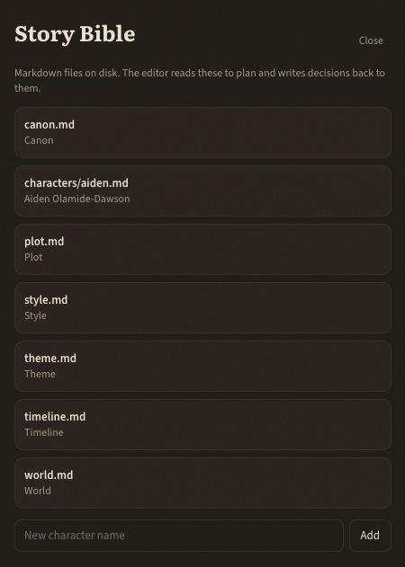

# Story bible

The story bible is the shared memory Ciciro uses to stay consistent. It is a
folder of markdown files on disk. The editor reads them to plan, and writes
decisions back so facts are not lost to chat scrollback.



Open it from **Story bible** in the manuscript header's **More** menu. Each row is a file you
can edit in the drawer or in any text editor. They live at
`data/<projectId>/bible/` and are gitignored as author content.

## What belongs where

| File | Keep here |
|---|---|
| `canon.md` | Hard facts and author rulings the story must never contradict. POV/tense, settled names, "the fire was arson." Short, always loaded. |
| `plot.md` | Structure, beats, open loops, payoffs. Check off loops as they resolve. |
| `style.md` | Voice, POV, tense, prose rules, dialogue conventions, narrator. Theme/tone notes belong here too. |
| `timeline.md` | Chronology on and off the page. Pull this when time order matters. |
| `world.md` | Settings, lore, and rules of the world. |
| `characters/<slug>.md` | One file per character: role, description, arc, and a **Voice** section (diction, rhythm, tics). |

The first non-empty line of each file is the one-line summary in the index. Put
the useful label first so the editor can find the right file without opening
everything.

## How the editor uses it

Context is built in tiers so it never bloats:

1. **Always loaded:** `canon.md`, `plot.md`, `style.md`.
2. **Index:** one-line summaries of every other bible file and every chapter.
3. **On demand:** full character files, world, timeline, and chapters - pulled
   with `read_bible` / `read_chapter` / `search_manuscript`.

That is why canon, plot, and style should stay small and current. Character
backstory, maps, and deep lore can be longer; they are opened only when needed.

When you establish a fact in chat ("she's British", "do not resolve the fire
yet"), the editor should record it in the same turn (`append_canon` or
`update_bible`) and tell you what it wrote. If it flags something instead of
writing it, confirm so it lands in the file, not only in the thread.

## Adding context for consistency

**Characters.** In the Story Bible footer, type a name and click **Add**. That
creates `characters/<slug>.md`. Fill in Voice early - the drafter never sees
the bible, so the editor copies voice notes into each brief. Distinct speech
patterns here are how dialogue stays in character across chapters.

**Who knows what.** Knowledge is a ledger, not another copy of the character
sheet, and it is chapter by chapter: in chapter 1 Joe may not know who has the
pen, by chapter 6 he suspects Suzy, and the ledger keeps both. Each fact is a
row: which character file it belongs to (`characters/<slug>.md`), the line
itself, a stance, the chapter it becomes true in (none: before the story
opens), an optional source quote, and an optional topic. The stances are:

| Stance | Means |
|---|---|
| **knows** | True, and the character is sure |
| **suspects** | They lean toward it but are not sure |
| **believes wrongly** (`believes_wrong`) | They are sure, and it is false: the dramatic-irony state |
| **doesn't know** (`unaware`) | Pinned on purpose: they must not act as if they know it yet |

No row means nothing is recorded, not that the character is unaware. Facts
from the ledger's first version that said "believes" read as **suspects**.

A fact holds from its chapter until it is retired, and retiring records the
chapter it stopped at, so earlier chapters keep it. "As of chapter N" means by
the end of chapter N. Chapter order is read live on both ends every time, so
reordering chapters moves the answer with them. Deleting a chapter (only an
empty one can be) moves its facts to the chapter that takes its place; a fact
whose chapter is archived drops out of every as-of view until the chapter is
restored. The rules live in `src/lib/knowledge-ledger.ts`, shared byte for
byte with the phone.

The ledger has its own screen: the **Knowledge** entry at the top of the
Story Bible (and, on the phone, in the bible's file list). It opens at the
chapter you have open, with a chapter scrubber across the top: slide (or step)
to a chapter to see where everyone stands by its end.

- **Timeline** (the default): each character's facts in story order. What
  holds at that point is plain; what has already ended is struck through with
  "until Ch. N" and, when a later fact shares its topic, what replaced it;
  what only becomes true later sits dimmed under "Later in the story".
  **Changes here** records a character's new view from the chapter in view and
  stops the old one there. **Stops here** retires a fact from the chapter in
  view on (a fact that begins at or after it is retired everywhere). Facts
  retired everywhere stay in a collapsed list.
- **By topic**: rows are topics, columns are characters, and each cell is that
  character's stance on the topic as of the scrubber's chapter. A topic is free
  text ("who has the pen"); characters line up when their facts share one,
  ignoring case and spacing. The optional **Reader** column shows the first
  `canon.md` line that mentions the topic, as the reader's ground truth.

Adding a fact defaults to the scrubber's chapter. The in-character-file list
(open a character file and use **Who knows what**) shows the ledger as it
stands now, adds from the chapter open in the editor, retires at it, and links
into the Knowledge screen.

**Asking Ciciro.** Tell the chat "record that Joe suspects Suzy has the pen"
and it calls `record_knowledge` against the chapter you have open (or the one
you name, or before the story opens), then says exactly what it recorded:
character, stance, fact, and chapter. Say "that changes in chapter 6" and it
records the new view with the old one stopping there. It only records what you
stated, matches the name against existing character files, and asks when the
name is unclear or has no file. "What does Joe know at this point?" reads the
ledger as of your open chapter (`read_knowledge`). `revise_knowledge` changes,
retires, or removes a fact when you ask. These are bible writes, so they work
on a **Chat only** turn too. Both clients send the open chapter with every chat
turn.

The file still shows the same lines. On every add, retire, or **Keep** from
What changed, Ciciro rewrites only the block between `<!-- knows:start -->`
and `<!-- knows:end -->` at the end of that character file, one line per fact
in force now with its stance and the chapter it dates from. The table is the
source of truth. The block is a mirror, so `read_bible` and a person opening
the file see the same thing.

Everything that reads the ledger reads it at a point in the story. The
editor's context lists the facts in force by the end of the open chapter for
characters named in it (capped), so drafting chapter 2 never sees what chapter
6 changes. The continuity check sends each chapter the facts in force by its
own end, so an early chapter is never flagged for not knowing a later reveal;
a contradiction still needs a verbatim quote from the chapter and from the
fact, and silence stays silence.

The ledger grows from **What changed** on the open chapter (see [Using
Ciciro](using-ciciro.md#what-changed)). That review proposes facts in the four
stances, given what the characters already know by the end of that chapter;
it does not write them until you keep one. It never creates a character file
for a name it does not already have.

**Canon.** Treat `canon.md` as a decision log, not a novel. One line per ruling:

```markdown
- POV / tense: close third, past
- Aiden is British; he does not code-switch in dialogue
- The fire in chapter 2 was arson (author ruling)
```

**Plot.** Keep open loops as a checklist. Ciciro's "Find loose ends" action
reads `plot.md` against the manuscript; unpaid setups only show up if they are
listed (or findable in the prose).

**Style.** Put non-negotiable prose rules here (no new named characters in a
scene, narrator knowledge, habits of yours Ciciro should keep). Em dashes are
off by default; the line `- Em dashes: allowed` switches them on (see [Craft
defaults and em dashes](using-ciciro.md#craft-defaults-and-em-dashes)). Theme alignment uses this
file. Already have chapters written? **Analyze my style** (top bar's **More**
menu) drafts this file and each speaking character's Voice section from your
own prose instead of you writing them cold - see [Using
Ciciro](using-ciciro.md#analyze-my-style).

You can also edit the files on disk. After the first run they are the source of
truth; the database is only used to seed them. Who knows what is the exception:
that ledger lives in its own table, and the block in the character file is only
the mirror.

## Practical habits

- Write rulings as facts, not vibes. "Cole lied to Mara in ch. 3; she knows"
  beats "things are tense between them."
- When a character changes, update that character file (or let Ciciro, after
  you confirm). The narrator is a tracked character too - first person in their
  file, third person in `style.md`.
- Do not paste whole chapters into the bible. The manuscript is retrieved; the
  bible holds decisions.
- If two files disagree, fix `canon.md` first. That file is always in the
  editor's prompt.

See [Using Ciciro](using-ciciro.md) for how to brief the editor so it actually
consults these files.
