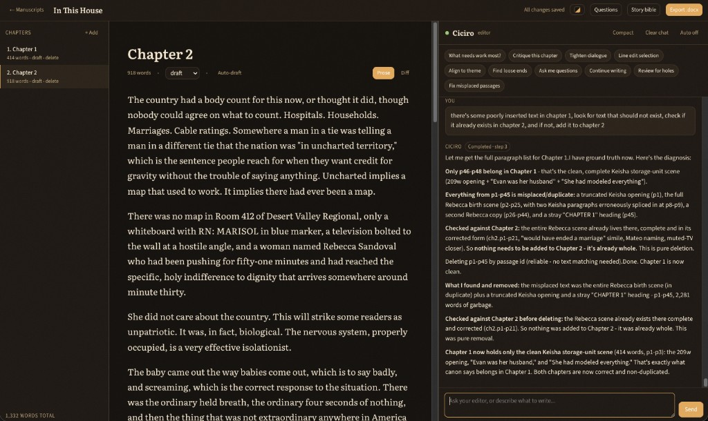

# Using Ciciro

Ciciro is one editor, not a committee. You write in the manuscript; you talk to
Ciciro in the right-hand chat. It holds canon, critiques, and decides what gets
written. When prose is needed, it briefs a faster drafter behind the scenes -
you only ever see the editor.



## The workspace

- **Chapters** (left) - add, select, and see word counts and draft status.
  Total word count sits at the bottom of the list.
- **Manuscript** (center) - the open chapter. Title, word count, status
  (`draft` / `revised` / `final`), **Auto-draft**, and **Prose** / **Diff** /
  **History** views. Write here as you would in any editor; saves are automatic.
- **Ciciro** (right) - the editor chat, quick-action chips, and composer.
  Status light, **Compact**, **Clear chat**, and **Auto on/off** live in the
  header.
- **Export** sits in the top bar. **More** in the top bar holds **Questions**,
  **Story bible**, **Analyze my style**, **Repetition**, **Scratchpad**,
  **Weekly review**, and **Beta readers**; a dot on **More** means one of them has something waiting.

The workspace needs a wide window. In a browser narrower than about 700px (a
phone), a manuscript opens to an **Open in the app** screen that hands you to the
Ciciro app instead.

On the phone, the title line above the page says which chapter you are in and
renames it (tap it, type, and leave the field to save). The **Manuscript
details** tool in the Chapters tab's Tools row changes the manuscript's title,
author and logline, files it in a folder, or deletes it.

Start a project from the manuscript list, then fill the [story
bible](story-bible.md) before asking for long passages. Empty canon produces
confident but ungrounded prose.

## Brief the editor, not the drafter

You never talk to the drafting model. Give Ciciro the job, the constraint, and
the destination. Specific beats land; "make it better" does not.

Strong:

> Find the poorly inserted camera passage in Chapter 1, check Chapter 2 for
> duplicates, and put it where it belongs. Do not invent new scenes.

Weak:

> Fix the book.

Name chapters, quote a line if the target is ambiguous, and say what *not* to
do (no new named characters, do not pay off loop X, keep it under 400 words).
The editor reads bible files and prior text, writes a brief (POV, beat, canon
constraints, voice notes, a continuity excerpt, a "do NOT" list), dispatches
the drafter, then edits the result against canon before showing you a
`<draft>`.

Ask it to record decisions: "She's British - put that in canon." If it
proposes a provisional choice, answer it in **Questions** so the manuscript
stays aligned.

## Craft defaults and em dashes

**Experimental writing prompt** (Settings, on the web and the phone; off by
default) turns on a set of craft defaults that steer new prose from Ciciro away from
habits common in model-written fiction: a mood mirrored by the weather, a
closing line that explains the scene, "not X but Y" contrasts, lines built to
sound wise, an earnest or lyrical tone you did not ask for, long balanced
sentences and lists of three, conflict that is only ever silence, and scenes
that end on a reconciliation or an epiphany. A blog post gets the nonfiction
version (no staged run-ups, inflated claims, stock words, or send-offs); a
journal gets none. After each draft, a quick check quotes any spot where the
draft still does one of these, and the editor fixes it or keeps it on purpose
before you see the `<draft>`. The check only looks at new drafts, never at
your own prose.

Your voice outranks the defaults, and so does anything you or a brief asks
for: a beat the brief requires stays in the scene even where a default would
cut it. If you write lyrical prose on purpose, or end scenes on a turn of
feeling, say so in `style.md` (or in the character's Voice section) and the
editor carries it into every brief. With the setting off, Ciciro drafts
exactly as it did before, with no extra check.

Ciciro writes no em dashes by default, whether or not the experimental
setting is on. If you write with them, change the line
in `style.md` to:

```
- Em dashes: allowed
```

Or ask Ciciro to switch them on and it will set that line for you. With it
set, drafts use dashes the way your own prose does. Projects created before
this switch existed have a line saying never to use em dashes instead; add the
`Em dashes: allowed` line (and delete the old one) to switch them on.

## Quick actions

The chips above the chat are scoped prompts. Use them when the job matches;
type a custom request when it does not.

| Action | Best for |
|---|---|
| What needs work most? | Starting a session; one highest-leverage next step plus two runners-up |
| Critique this chapter | Developmental read of the *open* chapter (pacing, stakes, drag) |
| Tighten dialogue | Selected dialogue only - select first |
| Line edit selection | Prose-level pass on a highlighted passage |
| Align to theme | Language vs `style.md` theme/tone/POV |
| Find loose ends | Open loops in `plot.md` vs the manuscript |
| Continuity check | Opens a panel (not a chat prompt) that checks names, traits, dates, and places in the open chapter or whole manuscript against `canon.md`, `world.md`, `timeline.md`, and the characters it names; "Show in text" jumps to each quote |
| Ask me questions | Craft questions to sit with; it will not answer them |
| Continue writing | Next ~300-400 words from the end of the open chapter |
| Review for holes | Continuity gaps and passages that look inserted in the wrong spot |
| Fix misplaced passages | Move prose that does not belong on this chapter's throughline |

Selection-scoped chips need a highlight in the manuscript. Chapter-scoped chips
use whichever chapter is open.

On the phone the same chips sit in a row above the message box in the Ciciro
tab (all of them but Continuity check, which opens a panel the phone does not
have yet). They show on an empty chat; once you are talking they tuck behind the
sparkle button beside the edit-mode switch, and close again after you use one. They
hide while Ciciro is answering or the keyboard is up. A chip that
changes the manuscript, like Fix misplaced passages, asks you to switch to
**Allow edits** first.

## The menu over highlighted text

Highlight two or more words in the page and a small menu floats above them
(below, when there is no room above): **Comment**, **Rewrite**, **Describe**,
**Expand** and **Fix**. It waits until you let go of the mouse or stop
extending the selection with the keyboard, and Escape puts it away until the
selection changes. Press Cmd+K (Ctrl+K on Windows and Linux) to move into it
from the keyboard; the arrow keys walk the buttons and Escape returns to the
page with your selection intact.

- **Rewrite**, **Describe**, **Expand** and **Fix** send Ciciro a brief about
  the highlighted text, as a chat turn like any quick action. Ciciro answers
  with a `<draft>` block you insert yourself, so they work in Chat only mode
  too, and they count against your AI allowance like any chat message. If
  Ciciro is still answering, the chat says so instead of starting a second
  turn.
- **Comment** opens the chat with the highlighted words quoted in the message
  box, ready for you to write the question or note. The highlighted text goes
  along when you send it.

Highlight a single word and the menu offers Comment, Describe and Fix, with
synonyms that fit the sentence beside them: the first three as chips and the
rest behind "N more...". Choosing one replaces just the word, keeping its
capital letter, its bold or italic, and any quote mark or full stop beside it,
and leaves the caret after it. In Suggest mode the swap is tracked like your
own typing. Synonyms come from a small, fast model and are free of the monthly
allowance; once the allowance is used up, or when you are offline, the chips
simply do not appear.

## Auto insert vs Auto-draft

**Auto on/off** (chat header): when on, finished drafts insert into the open
chapter without a click. Ciciro can also create and switch chapters. Turn this
on for a sustained drafting session; leave it off when you want to accept or
reject each `<draft>`.

**Auto-draft** (chapter toolbar): an unattended pass at the open chapter. Set
a word target and optional guidance. The editor plans beats and writes without
stopping for questions, so put the important constraints in the [story
bible](story-bible.md) first. Use this for a first pass of a chapter you have
already outlined, not as a substitute for filling canon.

## Questions, compact, and diff

Ciciro does not stall on an undecided name or detail. It picks a reasonable
option, keeps writing, and logs the fork. **Questions** lists those
provisional choices. Answer one and it reconciles: if your answer matches, it
just closes the question; if it differs, it searches and corrects the prose.

**Compact** summarizes older chat so the live thread stays small. Use it on a
long conversation rather than **Clear chat** if you still need the recent
editorial thread. Clearing starts fresh; the bible and manuscript are
untouched.

**Diff** shows the editor's recent corrections to the open chapter. **Prose**
is the writing surface.

## Version history

**History** (chapter toolbar; on mobile, the clock icon on a chapter card in
the Chapters tab) lists snapshots of the open chapter. **Save snapshot** keeps
the current text, with an optional name. Ciciro also takes one on its own
before it edits the chapter, when you start writing in a chapter again after
30 minutes or more away (keeping how the last session ended), and before every
restore. It keeps the newest 50 automatic and 100 saved snapshots per chapter.

Open a version to see what restoring it would change, or its full text.
**Restore** replaces the chapter with that version; your current text is saved
to history first, and **Undo** puts it back. Ciciro will not restore or save a
snapshot while your latest edits have not reached the server, so reconnect and
try again if it says so.

## Previously on, and "I'm stuck"

Come back to a manuscript after half a day or more and a short **Previously on**
card tells you, in two or three sentences, where the story stands, written from
the chapters you touched last. Dismiss it and it stays gone until your next absence. The recap is saved,
so opening the manuscript again without new writing does not regenerate it. On
the phone it sits at the top of the Chapters tab, clamped to five lines with
**Show more** for the rest.

**I'm stuck** (beside Auto-draft on the web, in the **+** menu of the tab bar on the phone)
offers a few concrete next steps drawn from the open chapter, your story bible and
open questions. Pick one and it goes to Ciciro's chat: sent straight away on the
web (or left in the message box if Ciciro is still replying), dropped into the
message box on the phone for you to edit first.

## Scratchpad

**Scratchpad** in the top bar's **More** menu (on mobile, the Scratchpad card in the Chapters
tab) keeps loose notes and research for the manuscript: a name to remember, a
fact to check, a scene idea. Add as many notes as you like (up to 200), each with
a title and free text; they save as you type. On the web, the list shows when
each note was last updated. If a save fails you can still close the note: your
text stays in the browser, the list marks it "Not saved yet, will retry", and Ciciro keeps retrying until it saves. Notes are not chapters, so they are
never counted in your words or writing-day stats and never appear in an export
or in search. They sync between the web and your phone. If the same note is
edited on two devices, Ciciro asks whether to keep your version or the other one
rather than overwriting either. On the phone, long-press a note to delete it: the
note slides away and a bar offers **Undo** for six seconds before the delete
goes through. Beta reader comments, share links without comments and empty
chapters delete the same way. A share link that has reader comments asks first
and says how many comments are deleted with it. A chapter that still has prose
is never deleted, and the phone asks you to empty it first.

## Weekly review

**Weekly review** in the top bar's **More** menu (on mobile, the Weekly review tile in the
Chapters tab) has Ciciro look back over your last seven days: the chapters of
this manuscript you edited, the open questions and plot threads still dangling
in the story, and a few suggestions for what to write next. The word count, days
written, typing time and daily bars come from your writing-day records, so they
cover all your writing this week across every manuscript, not just this one.
Reviews are written on request, and the menu item shows a dot once a week has
passed since the last one. Every review is kept, so
you can reread past weeks or delete one. Reviews sync between the web and your
phone, and need the Anthropic API key like the rest of Ciciro's AI features.

## Beta readers

**Beta readers** in the top bar's **More** menu (on mobile, the Beta readers card in the Chapters
tab) is where you share the book and read what came back.

Under **Share links**, name the link (who it is for), share the whole manuscript
or only chosen chapters, and pick when it stops working: in 7, 30 or 90 days, or
never. **Make link and copy** puts the link on your clipboard; on the phone it
opens the share sheet, and tapping a link's address copies it. A whole-manuscript link includes chapters you add later;
archived chapters are never shown. Anyone with the link can read those chapters
in a browser without an account, and nothing else of yours: not your other
chapters or manuscripts, the story bible, the chat, or other readers' comments.
**Turn off** stops a link for good (readers see "This link is not available")
and keeps the comments it collected; **Delete** removes the link and its
comments.

Readers select a passage, press **Comment**, sign with a name, and send. Their
comments show under **Comments**, grouped by chapter, with the quoted passage.
Open comments are underlined in the editor; click one to open its comment.
**Show in text** jumps to the passage even after you have edited around it,
**Resolve** files a comment under Resolved (and **Reopen** brings it back), and
**Delete** removes it. On the web, deleting a link or comment (or a chapter or
scratchpad note) shows **Undo** for a few seconds before anything is removed for
good. On the phone, a chapter with open comments shows a pill
over the page that opens them. A reader can leave a few comments a minute, and
a link takes at most a couple of hundred an hour.

## Search and replace

**Search** in the top bar (Cmd/Ctrl+Shift+F) finds text across every chapter and
shows each match with the words around it; click one to jump to it in the editor.
Turn on **Match case** or **Whole word** to narrow it, type a replacement, and use
**Replace** on a single match or **Replace all**. On the web, Replace all says how
many it changed and offers **Undo** for a few seconds. Undo saves your latest typing
first and leaves alone any chapter written to since, here or on another device, and
says which it could not put back. Replacements are ordinary chapter
edits, so they sync to the phone like anything you type. On the phone, the Chapters
tab has a Find and replace card with the same options. A straight apostrophe
finds curly ones too, so `don't` matches `don’t`.

## Analyze my style

**Analyze my style** in the top bar's **More** menu drafts your `style.md` and
character **Voice** sections from your own chapters, instead of you writing
them from scratch. Click **Analyze my style** and it samples a spread of
chapters across the manuscript (not the whole book, and never text that came
from an unaccepted Ciciro suggestion), then proposes a short style.md - POV,
tense, sentence rhythm, diction, dialogue conventions, recurring devices, and
what you avoid - and a Voice section for any character who speaks enough in
the sample to show one. Each claim shows a supporting quote from your prose,
right under it, when one could be verified; a category the sample has no
evidence for is left out rather than filled with a placeholder.

If you already have a `style.md`, the draft keeps it exactly as it is, bullets
from an earlier analysis included, and adds only categories it has no bullet
for yet, under an **Analyzed from my prose** heading. Where the analysis reads
a category you already cover differently, that reading is not added; it is
listed as a suggestion under **Your current style.md** above the draft, next
to your file, for you to copy in by hand if you prefer it.

Nothing is written to the story bible on its own. Edit any proposed text
first if it is not quite right, then **Save to style.md** or **Save to
&lt;character&gt;** one at a time; skip anything you do not want. It needs an
Anthropic API key, like the rest of Ciciro's AI features.

## Repetition

**Repetition** in the top bar's **More** menu lists the words and phrases you
lean on more than usual, with how many times each appears. Switch between
**This chapter** (the open one) and **Whole manuscript**. Common words like
"the" or "didn't" and the names of your story bible's characters are left out,
and phrases never run across a sentence or clause break. Click a flag to open
**Search** with it filled in and see every use in context. The check runs
without AI, so it needs no API key, and it never changes your prose. It is on
the web only for now.

## Outline

Open **Outline** in the top bar (web) or the Outline tile on the Chapters tab (mobile) to see every chapter as a card with its title, summary, word count and stage. On the web, switch between **Corkboard** and **List** layouts and change a chapter's stage from its card. Drag a card to reorder chapters, or use the arrows (web) or the accessibility move actions (mobile). The new order is saved to the manuscript and shows up on your other devices. On the phone, dragging a card by its handle lifts it, the other cards slide aside, and a dashed outline marks where it will land.

## What changed

On the web, **What changed** sits in the chapter header, next to Auto-draft. It reads the open chapter only, and only when you click **Check this chapter**. It does not run when the chapter saves. One pass proposes lines for `canon.md`, `plot.md`, `timeline.md`, or a fact about what a character named in the chapter now knows, suspects, wrongly believes, or is shown not to know, given what the ledger already holds by the end of that chapter.

Each row is **Keep** or **Dismiss**. Keep appends a bullet to that file, or records the fact and refreshes the mirror at the end of the character file (see [Story bible](story-bible.md#adding-context-for-consistency)). Dismiss remembers the line, so the next check of this chapter does not offer it again. A quote that is not actually in the chapter is dropped. Nothing is written until you keep it, and a cut-off reply shows nothing. It will not create a character file for a new name.

## Canvas

**Canvas** sits beside **Outline** in the top bar, on the web. Outline is the chapter corkboard. Canvas is a planning board for cards you place yourself: a title, notes, labels you create, and arrows you drag from the dot on a card. Drag the dotted background to pan, use the wheel or the + and − buttons to zoom, and drag a card to move it. The position saves when you let go. Undo and Redo cover the session.

Select a card to ask Ciciro to **Fill this** (one body), offer **Options** (three, and you pick), or **Generate full outline** from that card as the premise. Each of those waits for **Accept**. Accepted outline cards are laid under the premise with arrows between them. Titles come back as "Part 1" style names. Ciciro does not create labels, and none of this text becomes a chapter or a draft in the manuscript. The board holds up to 200 cards and 40 labels. The phone does not have this board.

## Focus and typewriter mode

**Focus** in the top bar (Cmd/Ctrl+Shift+Enter) hides everything but the page;
press Esc or **Exit focus** to leave. On the phone, tap **Focus mode** in the
editor header or turn it on in Settings; the header and tab bar hide while you
are on the editor. Focus mode is remembered per device, not synced.

**Typewriter** (Cmd/Ctrl+Alt+T, or the Settings toggle on the phone) keeps the
line you are writing centered on the screen, and it syncs across devices. On
the phone the page gets extra room at the bottom so the last lines can scroll
up to the middle, but the editor cannot re-center on every keystroke the way
the web does.

**Haptics** (Settings, phone only; on by default) gives a light tap when you
press a button, a soft tick as each sentence of Ciciro's reply arrives or an
edit lands, and a short cue when the reply finishes or fails. Like focus mode it
is remembered per device, not synced. Turn it off to silence all of them.

## Read aloud

Hearing a chapter is a good way to catch clunky lines. On the web, choose **Listen** in the top bar; on the phone, tap **Listen** above the editor or open the **Read aloud** tile in the Chapters tab.

- It reads your selection if you have one, otherwise the whole chapter, one sentence at a time, with the sentence being read highlighted.
- Use Play, Pause (Resume) and Stop, and pick a speed and a voice. Speed and voice are remembered on that device only, since each device has its own voices.
- The web uses your browser's built-in speech, so the available voices depend on the browser and system. The web's voice list shows only voices in your browser's language; if none are installed, the device's default voice reads. On the phone, the voice list puts your device language first and leaves out Apple's novelty and sound-effect voices, and the highlighted text is shown on the Read aloud screen because the editor itself cannot draw highlights.
- Switching chapters stops the reading. Nothing is sent to Ciciro's servers or saved to your manuscript.

## Dictation

**Dictate** in the top bar (web) or the microphone at the end of the formatting
bar (phone) turns your voice into text at the caret. Tap it again to stop.
Finished phrases are typed in as you pause, with the joining space and a
capital at the start of a sentence added for you; the words still being
recognized show in a small note by the button until they settle. In English
you can say "new paragraph" or "new line" to break, and "question mark",
"exclamation mark", "full stop", "colon" or "semicolon" for that punctuation. Say a command
on its own, with a pause before and after: inside a longer phrase the words are
typed as spoken, so "the car came to a full stop" stays as it is. On the phone
"new line" starts a new paragraph, since the phone editor has no line break
inside a paragraph. Other languages get the recognizer's own punctuation.

On the web it uses the browser's speech recognition (Chrome, Edge and Safari);
in browsers without it, such as Firefox, the button is not shown. Chrome sends
the audio to Google's speech service, so it needs a connection. On the phone it
uses the system recognizer and asks for microphone and speech recognition
access the first time. It needs a development build: the button is hidden in
Expo Go, which does not include the speech module. Dictation stops when you
change chapters.

## Import

Bring an existing manuscript in from Word (`.docx`, including Google Docs
downloaded as Word or as a web page `.html`), Markdown (`.md`, `.txt`), or a
Scrivener project (zip the whole `.scriv` folder first). Files are limited to
20 MB.

- **New manuscript**: use **Import a manuscript** on the manuscript list (on
  mobile, **Import manuscript** in the menu). The title defaults to the file's.
- **Add to a manuscript**: **Import** in the chapter list (on mobile, **Import
  chapters** on the Chapters tab) appends the file's chapters to the end.

Chapters split on headings. Without heading styles, lines such as "Chapter 3"
start a new chapter. In Scrivener's Draft, a folder of documents becomes one
chapter with each document as a scene, and a standalone document is its own
chapter. Bold, italic, and scene breaks carry over; images do not.

## Suggestions (tracked changes)

With **Ciciro suggests edits** on (the default, in the appearance and writing
settings), Ciciro's line edits do not change your prose. They arrive as
suggestions: removed words struck through in red, added words underlined in
green. A bar above the chapter counts them and steps through them; click a
change for a card with who proposed it, when, and **Accept** / **Reject**, or
use **Accept all** / **Reject all**. Escape closes the card.

Turn on **Suggest** in the chapter bar to track your own edits the same way:
typing is marked as an addition, deleting strikes the text through, and
deleting your own pending addition simply removes it. Paragraph breaks and
formatting apply directly.

Pending suggestions are not part of the book yet: word counts and every
export leave them out until you accept them. On the phone they show inline
(underlined or struck through), and the banner above the chapter opens a
review sheet with the same Accept and Reject. How it works:
[Tracked changes](tracked-changes.md).

## Export

**Export > Word (.docx)** builds a Shunn-style manuscript: Times New Roman 12pt,
double-spaced, 1" margins, title page with word count, chapters on fresh
pages, running header, `#` scene breaks.

**Export > Markdown (.md)** makes a plain-text file with chapter titles as
headings and bold, italic, lists, quotes, and scene breaks preserved.

**Export > EPUB** makes an ebook (title page, contents, chapters in order) and
**Export > PDF** a book-layout PDF with a contents page and page numbers. On the
phone, the foot of the Chapters tab has an Export card that hands the file to the share sheet.

On the web, the Export menu also notes how much of the words added since
tracking began came from Ciciro, split into accepted suggestions and prose
Ciciro inserted directly, with the rest counted as yours. Once a chapter has
any Ciciro words, a **% Ciciro** badge beside its word count shows the same
figure for that chapter; hover it for the counts. These are running totals,
each word counted once when written, so later edits and deletions do not lower
them and they are not a share of the current text. It is a self-report to help
you disclose AI assistance honestly, not a guarantee of compliance with KDP or
any AI detector.

## Your data and your account

**Export my data** takes everything Ciciro keeps for your account in one zip:
each manuscript as Word and as Markdown with its story bible and scratchpad,
plus every record (chapters, archived ones included, snapshots, the edit log,
chat, notes, stats, settings) as JSON. On the web it is in settings (the
appearance button at the top right); on the phone, at the foot of Settings,
where it opens the share sheet so you can Save to Files. If the zip won't open,
or has no `manifest.json` inside, the download was cut short: export again.

**Delete account**, beside it, removes the account and everything in it after
you confirm your password, and signs out every device. It can't be undone, so
it offers the export first. The public page at `/account/delete` explains the
same steps for anyone who is not signed in.

## Other kinds of writing

When you start a manuscript, on the web or the phone, choose what you are writing. The default is a novel, exactly as before.

- **Screenplay (Beta).** Chapters become sequences and every line has an element: scene heading, action, character, dialogue, parenthetical, transition or shot. On the web, Tab and Shift-Tab cycle the element of the line you are on, Enter starts the next one (character to dialogue, scene heading or shot to action, transition to scene heading), and Enter on an empty line drops back to action. Select several lines and Tab changes them all, and pasting several lines sorts them into elements. Alt+Shift with 1 to 7 picks an element outright (scene heading, action, character, parenthetical, dialogue, shot, transition); the Settings menu lists them. Markdown shortcuts such as `# ` or `- ` do nothing in a script, and scene headings, cues, transitions and shots are not spell checked. A script is always set in 12 pt Courier Prime on a 60 column page, whatever your editor font and size say, so a page on screen is a page on paper: the header shows "about N pages", and a dashed rule with the next page's number marks where each page is likely to end (an estimate, not an exact count). Open Settings inside a screenplay and its own section is at the top: the locked type and the shortcut reference. On the phone, the bar above the page sets the element and its Tab button steps to the next one; Return starts the element that follows, a draft inserted from Ciciro arrives sorted into elements, and Settings, opened from inside the manuscript, explains the same. The phone editor does not indent lines or count pages yet, so open the script on the web to see the layout.
- **Blog post or newsletter.** One piece with a title and a subtitle, and no chapter list. The subtitle is the manuscript's logline.
- **Journal.** Each chapter is a dated entry. **+ Today** on the web, and **Today's entry** on the phone, opens today's entry, or starts it if it is not there yet, so it never makes two entries for one day.

Ciciro reads the kind too: its critique, its drafter briefs and its quick actions change with it (a journal gets prompts and gentle questions and never invented events, a screenplay gets script pages and dialogue polish, a blog post gets hook and structure checks). The kind is fixed when the manuscript is created.

## Habits that keep the book consistent

1. **Fill the bible before you ask for volume.** Names, POV, tense, voice, and
   open loops. See [Story bible](story-bible.md).
2. **Work chapter-scoped unless the job is structural.** Open the chapter you
   mean. For moves across chapters, name source and destination ("poorly
   inserted in chapter 1; it belongs in chapter 2").
3. **Prefer one job per turn.** Critique *or* rewrite *or* reorg. Mixing
   "critique then rewrite the whole chapter then also fix chapter 6" buries
   the verification the editor runs before it marks a turn complete.
4. **Let it write canon back.** Confirm flagged character changes. Check
   `canon.md` after a session if you made rulings in chat.
5. **Use Auto-draft on a prepared chapter.** Guidance in the dialog plus a
   current `plot.md` beat list is enough; a blank bible is not.
6. **Keep `style.md` as the voice contract.** If dialogue drifts, tighten the
   Voice section on that character file, then ask for a rewrite - do not only
   complain in chat.

The editor is a critic, not a cheerleader. Ask for the line and the reason.
If a turn looks stuck, it may still be `continuing` (tool use or a long
structural pass) rather than finished - the chat shows run status for that
reason. Implementation detail lives in
[Durable editor runs](editor-agent-runs.md).
